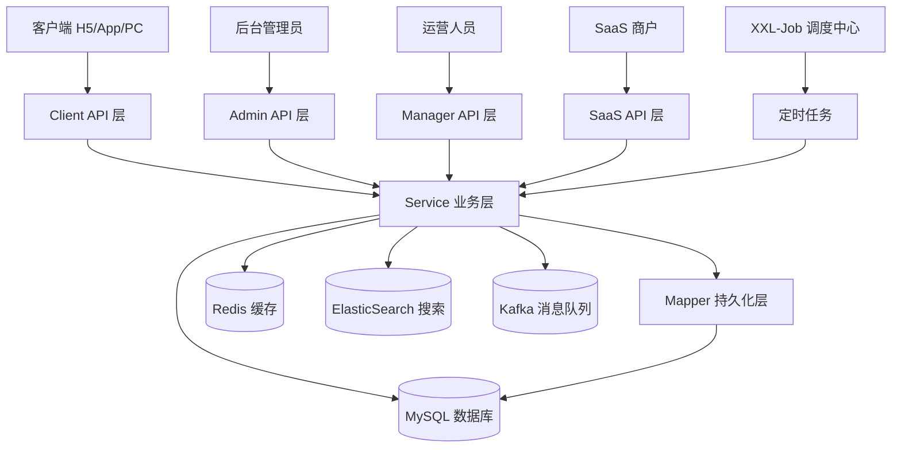
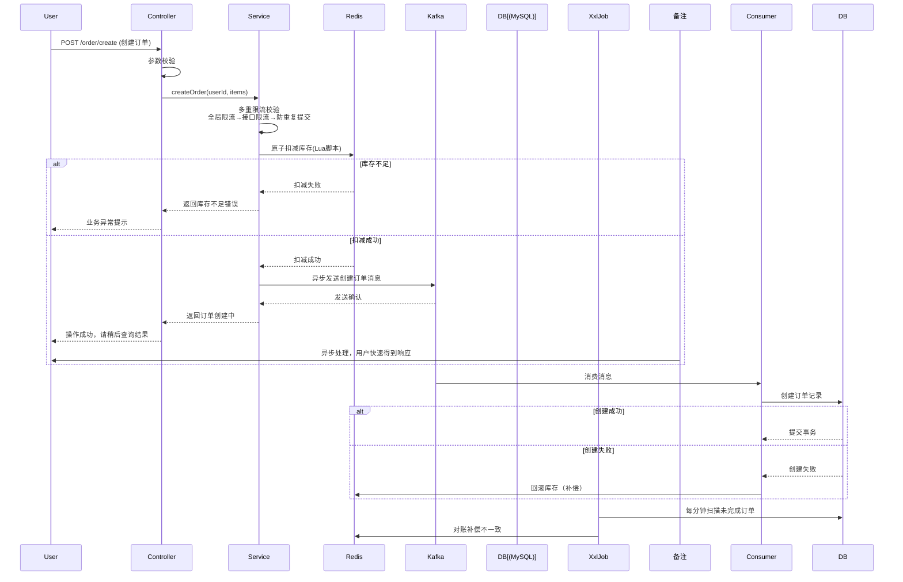
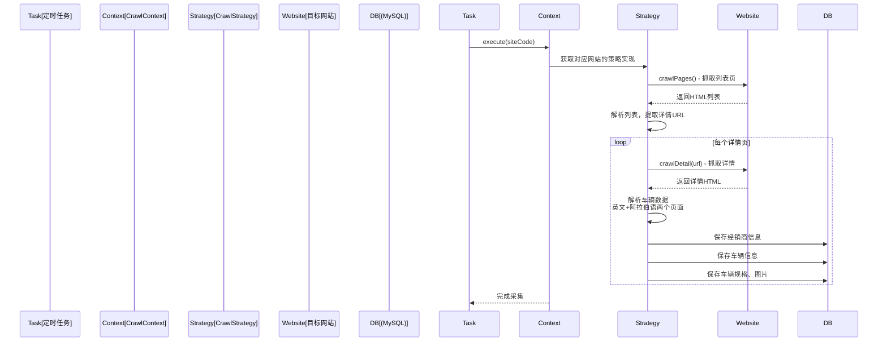

# 【Cartea-API】项目架构技术文档

版本号：v1.0.0
编写日期：2026-04-07
编写人：Claude
审核人：

**修订记录：**

| 版本号 | 修订日期 | 修订人 | 修订内容 |
|--------|----------|--------|----------|
| v1.0.0 | 2026-04-07 | Claude | 初始版本，完整项目架构分析 |

---

## 1. 文档基本信息

本文档为 **Cartea API** 整体项目架构文档，全面描述了项目的技术架构、模块划分、核心设计和实现方案。

**项目基本信息：**

| 项目属性 | 说明 |
|----------|------|
| 项目名称 | Cartea API |
| 项目定位 | 中东汽车交易/资讯平台 |
| 开发语言 | Java 17 |
| 构建工具 | Maven |
| 部署方式 | Docker + Kubernetes |
| 代码规模 | 133,091 行 Java 代码 |
| 支持语言 | 中文、英文、阿拉伯语 |

---

## 2. 需求背景

### 2.1 功能需求

Cartea API 是面向中东市场的汽车交易资讯平台后端服务，需要提供以下核心能力：

1. **汽车信息管理** - 品牌、车系、车型完整数据管理
2. **资讯内容发布** - 汽车新闻、评测、百科文章管理
3. **二手车交易** - 经销商入驻、车辆库存展示
4. **营销活动** - 优惠券发行、用户领取核销
5. **数据采集** - 第三方汽车网站数据爬虫
6. **全文搜索** - 基于 ElasticSearch 的文章和车辆搜索
7. **多语言支持** - 中、英、阿拉伯语三语言支持
8. **SEO优化** - Sitemap生成、关键词优化

### 2.2 业务价值

- 为中东汽车消费者提供一站式汽车资讯和交易信息服务
- 通过爬虫自动采集整合多方车源信息，提升数据获取效率
- 支持经销商线上展示库存，提升交易转化
- 通过营销活动吸引用户，提升平台活跃度

### 2.3 关联需求

- 需求来源：内部项目
- 前端地址：分离部署，独立前端项目
- 数据库：MySQL（腾讯云 CynosDB）

### 2.4 功能范围

**本次文档包含：**
- 整体项目架构设计
- 技术栈选型说明
- 核心模块划分
- 数据库设计概要
- 核心技术组件设计
- API 接口设计

**本文档不包含：**
- 具体业务需求细节
- 前端实现方案
- 运维部署配置细节

---

## 3. 系统设计

### 3.1 架构设计

#### 整体分层架构



#### 项目目录结构

```
src/main/java/com/ama/cartea/
├── CarteaApiApplication.java      # 主启动类
├── common/                         # 公共基础类
│   ├── BizException.java           # 业务异常
│   ├── Result.java                 # 统一响应封装
│   └── CPage.java                  # 分页封装
├── config/                         # Spring 配置类
│   ├── MyBatisPlusConfig.java
│   ├── ElasticSearchConfig.java
│   ├── XxlJobConfig.java
│   ├── ExecutorConfig.java
│   └── knife4jConfig.java
├── controller/                     # API 控制器（按权限分层）
│   ├── admin/                       # 后台管理接口 (14个Controller)
│   ├── client/                      # 客户端开放接口 (26个Controller)
│   ├── manager/                     # 运营管理接口 (14个Controller)
│   └── sass/                        # SaaS平台接口 (8个Controller)
├── dto/                            # 数据传输对象（按业务分包）
│   ├── article/
│   ├── car/
│   ├── order/
│   ├── user/
│   └── ... (共30+业务子包)
├── entity/                         # 数据库实体（按业务分包）
│   ├── article/
│   ├── car/
│   ├── content/
│   ├── user/
│   └── ... (共28个业务子包，336个实体)
├── enums/                          # 枚举定义
├── external/                       # 外部服务集成
├── interceptor/                    # MVC 拦截器
├── listener/                       # 事件监听器
├── mapper/                         # MyBatis Mapper 接口（169个）
├── mapstruct/                      # 对象转换映射
├── service/                        # 业务服务层（接口+实现，373个服务）
│   └── impl/                        # 具体实现
├── strategy/                       # 策略模式实现
│   ├── crawl/                       # 爬虫策略
│   ├── news/                        # 新闻爬取策略
│   └── sitemap/                     # Sitemap生成策略
├── task/                           # 定时任务
└── util/                           # 工具类
    └── redis/                       # Redis 工具
```

#### 模块说明

| 模块 | 职责 | 备注 |
|------|------|------|
| Controller 层 | 接收 HTTP 请求、参数校验、统一响应封装 | 按权限分为四层：admin/client/manager/sass |
| Service 层 | 核心业务逻辑处理、事务控制 | 面向接口编程，impl 放实现 |
| Mapper 层 | 数据库 CRUD 操作 | MyBatis-Plus + XML |
| Strategy 策略 | 多实现扩展点（爬虫、Sitemap等） | 开闭原则，新增实现不改核心代码 |
| Common 公共 | 统一异常、统一响应、分页 | 全项目共享基础能力 |
| Config 配置 | Spring Bean 配置 | 第三方组件集成配置 |

---

### 3.2 核心流程

#### 文章查询流程

```mermaid
sequenceDiagram
    participant 客户端
    participant Controller
    participant Service
    participant Cache[L1 Cache<br/>Caffeine]
    participant Redis[L2 Cache<br/>Redis]
    participant DB[(MySQL)]

    客户端->>Controller: GET /article/list (分页查询)
    Controller->>Controller: 参数校验
    Controller->>Service: pageQuery(query)
    Service->>Cache: 查询一级缓存
    alt 缓存命中(L1)
        Cache-->>Service: 返回结果
    else 未命中(L1)
        Service->>Redis: 查询二级缓存
        alt 缓存命中(L2)
            Redis-->>Service: 返回结果
            Service->>Cache: 回填L1缓存
        else 未命中(L2)
            Service->>DB: 数据库查询
            DB-->>Service: 返回结果
            Service->>Redis: 回填L2缓存
            Service->>Cache: 回填L1缓存
        end
    end
    Service-->>Controller: 返回分页结果
    Controller-->>客户端: Result<IPage<Article>> 统一响应
```

#### 订单创建流程（并发场景）



#### 爬虫数据采集流程（策略模式）



**异常流程处理：**

| 场景 | 处理方式 |
|------|----------|
| 参数校验失败 | 返回错误码+中文/英文提示 |
| 数据不存在 | 返回 404 提示资源未找到 |
| 无权限访问 | 返回 403 提示无权限 |
| 并发限流触发 | 返回 429 提示请求过于频繁 |
| 重复提交 | 返回错误提示请勿重复提交 |
| 库存不足 | 返回业务提示库存不足 |
| 系统异常 | 记录错误日志，返回系统繁忙 |

---

### 3.3 接口设计

**接口分层：**

| 层级 | 路径前缀 | 访问权限 | 用途 |
|------|---------|----------|------|
| client | `/cartea-api/` | 公开/需要 Token | 客户端（H5/App/PC）调用 |
| admin | `/cartea-api/admin/` | 超级管理员 | 后台系统管理 |
| manager | `/cartea-api/manager/` | 运营人员 | 内容运营管理 |
| sass | `/cartea-api/sass/` | SaaS 商户 | SaaS 平台商户自助管理 |

**接口列表（示例-文章模块）：**

| 接口地址 | 请求方式 | 接口描述 | 权限要求 |
|----------|----------|----------|----------|
| `/article/rss` | GET | 获取 RSS 订阅 | 公开 |
| `/article/recommend` | GET | 获取推荐文章列表 | 公开 |
| `/article/list` | GET | 文章分页列表 | 公开 |
| `/article/detail` | GET | 获取文章详情 | 公开 |
| `/article/interactive` | POST | 文章互动（点赞/收藏） | 需要登录 |
| `/admin/article/list` | GET | 后台文章列表 | 管理员 |
| `/admin/article/save` | POST | 新增/编辑文章 | 管理员 |
| `/admin/article/status` | POST | 更新文章状态 | 管理员 |

---

#### 接口详情示例

**GET `/cartea-api/article/list` — 获取文章分页列表**

请求参数：

```
pageNum: 1        // 页码，默认1
pageSize: 10      // 每页条数，默认10
categoryId: 100   // 分类ID，可选
tagId: 50         // 标签ID，可选
keyword: "宝马"    // 搜索关键词，可选
orderBy: "publishedAt"  // 排序字段，可选
```

响应参数：

```json
{
  "code": 0,
  "msg": "成功",
  "enMsg": "success",
  "data": {
    "records": [
      {
        "id": 1001,                  // 文章ID
        "title": "宝马全新X5评测",    // 文章标题
        "slug": "bmw-new-x5-review", // 文章URL slug
        "coverUrl": "https://...",   // 封面图URL
        "summary": "本文深度评测...", // 摘要
        "author": "作者名",           // 作者
        "publishedAt": "2026-04-01 10:00:00", // 发布时间
        "readCount": 12500,          // 阅读数
        "likeCount": 325             // 点赞数
      }
    ],
    "total": 1250,
    "pageNum": 1,
    "pageSize": 10,
    "pages": 125
  }
}
```

---

**POST `/cartea-api/order/create` — 创建订单**

请求参数：

```json
{
  "storeCode": "1001",             // 必填，门店编码
  "items": [
    {
      "productCode": "coupon_001", // 必填，商品编码
      "quantity": 1,               // 必填，数量
      "couponId": 10001            // 可选，使用的优惠券ID
    }
  ]
}
```

响应参数：

```json
{
  "code": 0,
  "msg": "创建成功",
  "enMsg": "created successfully",
  "data": {
    "orderId": "1030938730000733964700499858",
    "orderCode": "OD2026040112345",
    "originalPrice": 10000,        // 原价（分）
    "discountPrice": 2000,         // 优惠（分）
    "payPrice": 8000,              // 实付（分）
    "status": 1                    // 1待支付 2已支付
  }
}
```

错误响应示例：

```json
{
  "code": 1,
  "msg": "库存不足，请选择其他商品",
  "enMsg": "Insufficient stock",
  "data": null
}
```

---

### 3.4 依赖说明

**核心第三方依赖：**

| 依赖名称 | 版本 | 引入原因 | Maven 坐标 |
|----------|------|----------|------------|
| spring-boot-starter-web | 2.6.13 | Spring Boot Web 框架 | `org.springframework.boot:spring-boot-starter-web` |
| mybatis-plus-boot-starter | 3.5.5 | MyBatis-Plus ORM 框架 | `com.baomidou:mybatis-plus-boot-starter` |
| redisson-spring-boot-starter | 3.18.0 | Redis 客户端、分布式锁 | `org.redisson:redisson-spring-boot-starter` |
| spring-kafka | - | Kafka 消息队列 | `org.springframework.kafka:spring-kafka`
| mapstruct | 1.5.5.Final | 编译期 DTO-Entity 对象转换 | `org.mapstruct:mapstruct` |
| knife4j-openapi2-spring-boot-starter | 4.5.0 | OpenAPI 接口文档 | `com.github.xiaoymin:knife4j-openapi2-spring-boot-starter` |
| lombok | 1.18.30 | 注解简化代码 | `org.projectlombok:lombok` |
| xxl-job-core | 2.3.1 | 分布式定时任务 | `com.xuxueli:xxl-job-core` |
| jsoup | 1.15.3 | HTML 解析（爬虫） | `org.jsoup:jsoup` |
| javacv | 1.5.9 | 视频处理、截图 | `org.bytedeco:javacv` |
| java-jwt | 4.4.0 | JWT 令牌认证 | `com.auth0:java-jwt` |
| hutool-all | 5.8.22 | 工具类库 | `cn.hutool:hutool-all` |
| aliyun-java-sdk-core | - | 阿里云 OSS/CDN | `com.aliyun:aliyun-java-sdk-core` |
| cos_api-bundle | - | 腾讯云 COS | `com.qcloud:cos_api-bundle` |
| easyexcel | 3.3.2 | Excel 读写 | `com.alibaba:easyexcel` |
| spring-boot-starter-actuator | - | 应用监控指标 | `org.springframework.boot:spring-boot-starter-actuator` |

---

## 4. 功能实现

### 4.1 实现思路

#### 多级缓存设计

**核心逻辑说明：**
1. **两级缓存**：一级使用 Caffeine 进程内缓存，读取速度极快；二级使用 Redis 分布式缓存，保证集群一致性
2. **缓存穿透防护**：使用布隆过滤器预加载所有存在的数据 ID，拦截不存在的 ID 查询
3. **缓存击穿防护**：使用"本地锁 + 分布式锁"双层锁，只有一个线程穿透到数据库加载
4. **缓存雪崩防护**：过期时间基于业务时间计算（如演出开始后自动过期），避免集中过期
5. **缓存一致性**：写操作删除两级缓存，通过定时对账任务补偿不一致

**技术选型：**

| 技术点 | 选择方案 | 原因 |
|--------|----------|------|
| L1 缓存 | Caffeine | Java 生态性能最高的本地缓存，基于 LRU 淘汰 |
| L2 缓存 | Redis + Redisson | 分布式环境一致性，支持分布式锁、延迟队列 |
| 防穿透 | 布隆过滤器 | 空间效率极高，可快速判断不存在的数据 |
| 防击穿 | 本地锁 + 分布式锁 | 双层锁减少 Redis 竞争，同一个 JVM 只有一个线程穿透 |

---

#### 分布式锁设计

**核心逻辑说明：**
1. **注解驱动**：使用 `@ServiceLock` 注解标记需要加锁的方法，AOP 自动处理加锁解锁
2. **工厂模式**：支持四种锁类型（可重入、公平、读锁、写锁），工厂根据注解配置创建对应实现
3. **双层锁**：先加本地锁，再加分布式锁，减少 Redis 网络 IO 和竞争
4. **SpEL 动态 Key**：支持从方法参数中动态提取锁的 Key，灵活适配不同场景
5. **自动续期**：支持锁自动续期（看门狗），防止业务执行时间超过锁过期时间

**技术选型：**

| 技术点 | 选择方案 | 原因 |
|--------|----------|------|
| 切面编程 | Spring AOP | 无侵入增强，不污染业务代码 |
| 分布式锁实现 | Redisson | 成熟稳定，支持可重入、看门狗续期 |
| 锁类型 | 四种 | 读多写少场景用读写锁提升并发 |

---

#### 一致性补偿设计

采用**五层兜底**保证最终一致性：

1. **第一层：即时回滚** - Redis 扣减成功但订单创建失败，立即回滚 Redis 库存
2. **第二层：记录+定时重试** - MQ 消息消费失败，记录失败日志，每分钟重试一次
3. **第三层：对账补偿** - 每 3 分钟对比 Redis 和 DB 数据，自动补偿不一致
4. **第四层：全量恢复** - 每日凌晨从 DB 全量重建 Redis 缓存，彻底修正不一致
5. **第五层：人工介入** - 自动补偿失败，记录异常等待人工处理

**核心算法**：逆向还原补偿 - 从当前状态逆向逐步恢复到一致状态

---

#### 爬虫策略设计

**核心逻辑说明：**
1. **策略接口**：定义 `CrawlStrategy` 爬虫统一接口，包含列表抓取、详情解析、数据保存等方法
2. **上下文执行**：`CrawlContext` 负责根据网站选择对应策略，执行统一的抓取流程
3. **开放扩展**：新增网站只需要新增一个策略实现类，不需要修改上下文代码
4. **双语抓取**：大部分中东网站同时提供英文和阿拉伯语版本，分别抓取两个版本内容

**技术选型：**

| 技术点 | 选择方案 | 原因 |
|--------|----------|------|
| HTML 解析 | Jsoup | Java 生态最流行的 HTML 解析库，API 友好 |
| 扩展方式 | 策略模式 | 完全符合开闭原则，新增网站不影响现有代码 |
| 调度方式 | XXL-Job | 分布式定时调度，支持不同网站配置不同执行周期 |

---

### 4.2 核心代码说明

**核心类和组件：**

| 类名 | 方法名 | 功能描述 | 文件路径 |
|------|--------|----------|----------|
| `CrawlStrategy` | - | 爬虫策略接口，定义统一爬虫方法 | `com/ama/cartea/strategy/crawl/CrawlStrategy.java:1` |
| `CrawlContext` | `execute` | 爬虫上下文，执行统一抓取流程 | `com/ama/cartea/strategy/crawl/CrawlContext.java:1` |
| `CrawlDubizzleStrategy` | `crawlPages, crawlDetail` | Dubizzle 网站爬虫实现 | `com/ama/cartea/strategy/crawl/impl/CrawlDubizzleStrategy.java:1` |
| `ServiceLockAspect` | `around` | 分布式锁 AOP 切面，自动加锁解锁 | `com/ama/cartea/common/lock/aspect/ServiceLockAspect.java:1` |
| `ServiceLockFactory` | `getLocker` | 分布式锁工厂，创建对应类型锁 | `com/ama/cartea/common/lock/factory/ServiceLockFactory.java:1` |
| `MultistageCache` | `get, put, delete` | 多级缓存工具类 | `com/ama/cartea/common/cache/MultistageCache.java:1` |
| `Result` | - | 统一响应封装 | `com/ama/cartea/common/Result.java:1` |
| `BizException` | - | 业务异常基类 | `com/ama/cartea/common/BizException.java:1` |
| `MyBatisPlusConfig` | - | MyBatis-Plus 配置 | `com/ama/cartea/config/MyBatisPlusConfig.java:1` |
| `ArticleController` | - | 文章客户端接口 | `com/ama/cartea/controller/client/ArticleController.java:1` |
| `OrderController` | `create` | 创建订单接口 | `com/ama/cartea/controller/client/OrderController.java:1` |
| `Article` | - | 文章实体类 | `com/ama/cartea/entity/content/Article.java:1` |
| `UserOrder` | - | 用户订单实体 | `com/ama/cartea/entity/car/UserOrder.java:1` |
| `ArticleMapper` | - | 文章 MyBatis Mapper | `com/ama/cartea/mapper/content/ArticleMapper.java:1` |

---

### 4.3 异常处理

**统一异常体系：**

| 异常类型 | 处理方式 | 响应格式 |
|----------|----------|----------|
| `BizException` | 业务异常，已知错误 | `code:1, msg:业务消息` |
| 参数校验异常 | JSR303 校验失败 | `code:400, msg:字段 + 错误提示` |
| 404 不存在 | 接口或资源不存在 | `code:404, msg:资源不存在` |
| 403 无权限 | 访问被拒绝 | `code:403, msg:无权限访问` |
| 系统未知异常 | 未捕获异常 | `code:500, msg:系统繁忙，请稍后重试` |

**核心错误码范围：**

| 错误码范围 | 含义 |
|----------|------|
| 1xxxx | 业务通用错误 |
| 2xxxx | 用户相关错误 |
| 3xxxx | 订单相关错误 |
| 4xxxx | 库存相关错误 |
| 5xxxx | 优惠券相关错误 |

**降级方案：**

- **爬虫失败**：记录失败任务，下次调度自动重试，不影响其他网站爬虫
- **Redis 不可用**：降级直连数据库，记录告警，保证核心服务可用
- **ElasticSearch 不可用**：搜索降级使用数据库 LIKE 查询，功能可用性能下降
- **Kafka 发送失败**：记录消息，定时任务重试发送，不阻塞主流程

---

## 5. 数据库设计

### 5.1 表结构变更

本项目已稳定运行，本文档为整体架构文档，不涉及表结构变更。以下是核心表结构说明：

#### 核心表概览

| 表类别 | 表名 | 说明 |
|--------|------|------|
| 用户相关 | `c_user` | C端用户表 |
| 用户相关 | `administrator` | 后台管理员表 |
| 用户相关 | `c_user_behavior_log` | 用户行为日志表 |
| 内容相关 | `article` | 文章表 |
| 内容相关 | `article_tag` | 文章标签表 |
| 内容相关 | `topic` | 话题表 |
| 内容相关 | `comment` | 评论表 |
| 汽车相关 | `car_brand` | 汽车品牌表 |
| 汽车相关 | `car_model` | 车系表 |
| 汽车相关 | `car_trim` | 车型表 |
| 经销商相关 | `dealer` | 经销商表 |
| 经销商相关 | `car_trim_dealer` | 经销商车辆表 |
| 营销相关 | `coupon` | 用户优惠券表 |
| 营销相关 | `coupon_template` | 优惠券模板表 |
| 订单相关 | `user_order` | 用户订单表 |
| 爬虫相关 | `crawl_task` | 爬虫任务记录表 |
| SEO相关 | `seo_keyword` | SEO 关键词表 |
| SEO相关 | `sitemap_config` | Sitemap 配置表 |

---

#### 核心表示例 - 文章表 `article`

```sql
CREATE TABLE `article` (
  `id`               bigint         NOT NULL AUTO_INCREMENT COMMENT '主键ID',
  `title`            varchar(500)   NOT NULL COMMENT '文章标题',
  `slug`             varchar(200)            COMMENT 'URL slug',
  `article_type`     tinyint        NOT NULL COMMENT '文章类型：1-新闻 2-评测 3-百科',
  `cover_url`        varchar(500)            COMMENT '封面图URL',
  `summary`          varchar(1000)           COMMENT '文章摘要',
  `main_content`     text           COMMENT '正文（原文）',
  `main_content_zh`  text           COMMENT '正文（中文翻译）',
  `main_content_ar`  text           COMMENT '正文（阿拉伯语翻译）',
  `main_content_en`  text           COMMENT '正文（英文翻译）',
  `author_id`        bigint         NOT NULL COMMENT '作者ID',
  `author_name`      varchar(100)   NOT NULL COMMENT '作者名称',
  `published_at`     datetime       NOT NULL COMMENT '发布时间',
  `status`           tinyint        NOT NULL DEFAULT '1' COMMENT '状态：1-发布 0-草稿 2-下架',
  `read_count`       int            NOT NULL DEFAULT '0' COMMENT '阅读数',
  `like_count`       int            NOT NULL DEFAULT '0' COMMENT '点赞数',
  `collect_count`    int            NOT NULL DEFAULT '0' COMMENT '收藏数',
  `create_time`      datetime       NOT NULL DEFAULT CURRENT_TIMESTAMP COMMENT '创建时间',
  `update_time`      datetime       NOT NULL DEFAULT CURRENT_TIMESTAMP ON UPDATE CURRENT_TIMESTAMP COMMENT '更新时间',
  PRIMARY KEY (`id`),
  KEY `idx_article_type_status` (`article_type`, `status`),
  KEY `idx_published_at` (`published_at`),
  KEY `idx_author_id` (`author_id`)
) ENGINE=InnoDB DEFAULT CHARSET=utf8mb4 COMMENT='文章表';
```

**索引说明：**

| 索引名 | 字段 | 类型 | 说明 |
|--------|------|------|------|
| PRIMARY | `id` | 主键 | |
| `idx_article_type_status` | `article_type, status` | 联合索引 | 按类型和状态筛选 |
| `idx_published_at` | `published_at` | 普通索引 | 按发布时间排序 |
| `idx_author_id` | `author_id` | 普通索引 | 按作者查询文章 |

---

#### 核心表示例 - 用户订单表 `user_order`

```sql
CREATE TABLE `user_order` (
  `id`             bigint         NOT NULL AUTO_INCREMENT COMMENT '主键ID',
  `order_code`     varchar(64)    NOT NULL COMMENT '订单编号',
  `user_id`        bigint         NOT NULL COMMENT '用户ID',
  `phone_number`  varchar(20)             COMMENT '用户手机号',
  `store_code`     varchar(20)    NOT NULL COMMENT '门店编码',
  `product_id`     bigint         NOT NULL COMMENT '商品ID',
  `product_name`   varchar(200)   NOT NULL COMMENT '商品名称',
  `quantity`       int            NOT NULL DEFAULT '1' COMMENT '购买数量',
  `original_price` int            NOT NULL COMMENT '原价（分）',
  `discount_price` int            NOT NULL DEFAULT '0' COMMENT '优惠金额（分）',
  `pay_price`      int            NOT NULL COMMENT '实付金额（分）',
  `status`         tinyint        NOT NULL DEFAULT '1' COMMENT '状态：1-待支付 2-已支付 3-已使用 4-已过期 5-已取消',
  `pay_time`       datetime                COMMENT '支付时间',
  `use_time`       datetime                COMMENT '使用时间',
  `create_time`    datetime       NOT NULL DEFAULT CURRENT_TIMESTAMP COMMENT '创建时间',
  `update_time`    datetime       NOT NULL DEFAULT CURRENT_TIMESTAMP ON UPDATE CURRENT_TIMESTAMP COMMENT '更新时间',
  PRIMARY KEY (`id`),
  UNIQUE KEY `uk_order_code` (`order_code`),
  KEY `idx_user_id_status` (`user_id`, `status`),
  KEY `idx_create_time` (`create_time`),
  KEY `idx_store_code` (`store_code`)
) ENGINE=InnoDB DEFAULT CHARSET=utf8mb4 COMMENT='用户订单表';
```

---

#### 核心表示例 - C端用户表 `c_user`

```sql
CREATE TABLE `c_user` (
  `id`             bigint         NOT NULL AUTO_INCREMENT COMMENT '主键ID',
  `c_user_id`      varchar(64)    NOT NULL COMMENT '客户端用户唯一标识',
  `cartea_user_id` bigint                  COMMENT '绑定Cartea会员ID',
  `phone_number`   varchar(20)             COMMENT '手机号',
  `email`          varchar(100)            COMMENT '邮箱',
  `nickname`       varchar(100)            COMMENT '昵称',
  `avatar_url`     varchar(500)            COMMENT '头像URL',
  `source_channel` varchar(100)            COMMENT '来源渠道：Google Ads, Facebook...',
  `country`        varchar(100)            COMMENT '国家',
  `region`         varchar(100)            COMMENT '地区/城市',
  `register_time`  date                  COMMENT '注册时间',
  `first_visit_time` date                COMMENT '首次访问时间',
  `first_visit_port` varchar(20)          COMMENT '首次访问入口：H5, PC, APP',
  `status`         tinyint        NOT NULL DEFAULT '1' COMMENT '状态：1-正常 0-禁用',
  `create_time`    datetime       NOT NULL DEFAULT CURRENT_TIMESTAMP COMMENT '创建时间',
  `update_time`    datetime       NOT NULL DEFAULT CURRENT_TIMESTAMP ON UPDATE CURRENT_TIMESTAMP COMMENT '更新时间',
  PRIMARY KEY (`id`),
  UNIQUE KEY `uk_c_user_id` (`c_user_id`),
  KEY `idx_status` (`status`),
  KEY `idx_register_time` (`register_time`)
) ENGINE=InnoDB DEFAULT CHARSET=utf8mb4 COMMENT='C端用户表';
```

---

### 5.2 数据迁移

本文档为整体项目架构文档，不涉及数据迁移。如需进行版本迭代数据迁移，请提供具体变更范围后生成迁移脚本。

---

## 6. 核心设计模式应用

本项目大量使用设计模式提升可扩展性和可维护性：

| 设计模式 | 应用场景 | 优势 |
|----------|----------|------|
| **策略模式** | 多站点爬虫、不同来源新闻、Sitemap生成 | 新增网站不需要修改现有代码，完全符合开闭原则 |
| **工厂模式** | 分布式锁工厂，根据类型创建不同锁 | 封装创建细节，新增锁类型不影响客户端代码 |
| **组合模式** | 订单创建多级校验链 | 方便新增校验步骤，每个校验单一职责 |
| **模板方法** | 购票流程骨架 | 提取公共代码，保证流程一致性 |
| **代理模式** | AOP切面（分布式锁、防重复提交） | 无侵入增强业务功能 |
| **享元模式** | 本地锁缓存，复用同一个key的锁对象 | 减少对象创建，节省内存 |
| **观察者模式** | Spring事件机制、Kafka消息 | 解耦生产者和消费者 |
| **建造者模式** | Lombok @Builder 构建复杂DTO | 链式调用，参数清晰 |
| **单例模式** | Spring Bean 默认单例 | 减少对象创建开销 |
| **适配器模式** | Redisson锁适配自定义接口 | 将第三方API适配成项目统一接口 |

---

## 7. 测试方案

### 6.1 测试范围

| 测试类型 | 覆盖内容 | 负责人 |
|----------|----------|--------|
| 单元测试 | Service 层核心业务逻辑 | 开发 |
| 接口测试 | 所有 API 接口 | 开发/测试 |
| 功能测试 | 完整业务流程（下单、支付、核销） | 测试 |
| 性能测试 | 核心并发接口（创建订单、库存扣减） | 开发/测试 |
| 回归测试 | 关联模块影响范围 | 测试 |

### 6.2 核心测试用例

| 用例编号 | 测试场景 | 前置条件 | 操作步骤 | 预期结果 |
|----------|----------|----------|----------|----------|
| TC-001 | 缓存穿透查询不存在ID | 无 | 传入不存在的文章ID查询 | 布隆过滤器拦截，直接返回不存在，不穿透到DB |
| TC-002 | 缓存击穿并发查询同一ID | 缓存为空 | 100个并发同时查询同一个存在的ID | 只有一个线程穿透到DB加载，其他线程等待缓存 |
| TC-003 | 分布式锁并发创建订单 | 库存只剩1张 | 100个并发同时创建同一张优惠券订单 | 只有1个创建成功，其他提示库存不足，不超卖 |
| TC-004 | 一致性补偿验证 | Redis扣减成功DB插入失败 | 模拟DB插入失败 | Redis库存立即回滚，数据保持一致 |
| TC-005 | 新增爬虫网站 | 新增一个策略实现 | 配置定时任务执行 | 正确选择对应策略执行，数据正确保存 |
| TC-006 | 四层限流验证 | 超过接口限流阈值 | 连续快速请求接口 | 触发限流后返回请求过于频繁提示 |

### 6.3 性能指标

| 接口 | 预期 QPS | 预期响应时间（P99） |
|------|----------|-------------------|
| 文章列表查询（命中缓存） | ≥ 5000 | ≤ 20ms |
| 文章详情查询（命中缓存） | ≥ 8000 | ≤ 10ms |
| 订单创建 | ≥ 500 | ≤ 200ms |
| 优惠券领取 | ≥ 1000 | ≤ 100ms |
| 全文搜索 | ≥ 200 | ≤ 200ms |

---

## 总结

### 项目特点总结

1. **垂直领域专注** - 面向中东市场的汽车交易资讯平台，支持三语言
2. **企业级架构设计** - 分层清晰，模块化，设计模式合理应用
3. **高并发处理能力** - 多级缓存、分布式锁、限流防刷、异步削峰
4. **数据一致性保证** - 五层兜底补偿机制，保证最终一致性
5. **良好可扩展性** - 策略模式支持快速新增爬虫网站
6. **完善技术文档** - 项目已有 14 篇核心技术文档，累计 7000+ 行

### 统计数据

| 指标 | 数量 |
|------|------|
| 总 Java 代码行数 | 133,091 |
| 实体类数量 | 336 |
| 控制器数量 | 62 |
| 服务类数量 | 373 |
| Mapper 接口数量 | 169 |
| Mapper XML 文件 | 234 |
| 技术文档 | 14 篇 |

### 核心文件路径

| 类型 | 路径 |
|------|------|
| 主启动类 | `src/main/java/com/ama/cartea/CarteaApiApplication.java` |
| 统一响应 | `src/main/java/com/ama/cartea/common/Result.java` |
| 统一异常 | `src/main/java/com/ama/cartea/common/BizException.java` |
| MyBatisPlus 配置 | `src/main/java/com/ama/cartea/config/MyBatisPlusConfig.java` |
| 爬虫策略接口 | `src/main/java/com/ama/cartea/strategy/crawl/CrawlStrategy.java` |
| 爬虫上下文 | `src/main/java/com/ama/cartea/strategy/crawl/CrawlContext.java` |
| 分布式锁切面 | `src/main/java/com/ama/cartea/common/lock/aspect/ServiceLockAspect.java` |
| 多级缓存 | `src/main/java/com/ama/cartea/common/cache/MultistageCache.java` |
| Maven POM | `pom.xml` |
| Spring 配置 | `src/main/resources/application.yml` |
| Mapper XML 目录 | `src/main/resources/mapper/` |
| 技术文档目录 | `docs/` |
| Dockerfile | `Dockerfile` |
