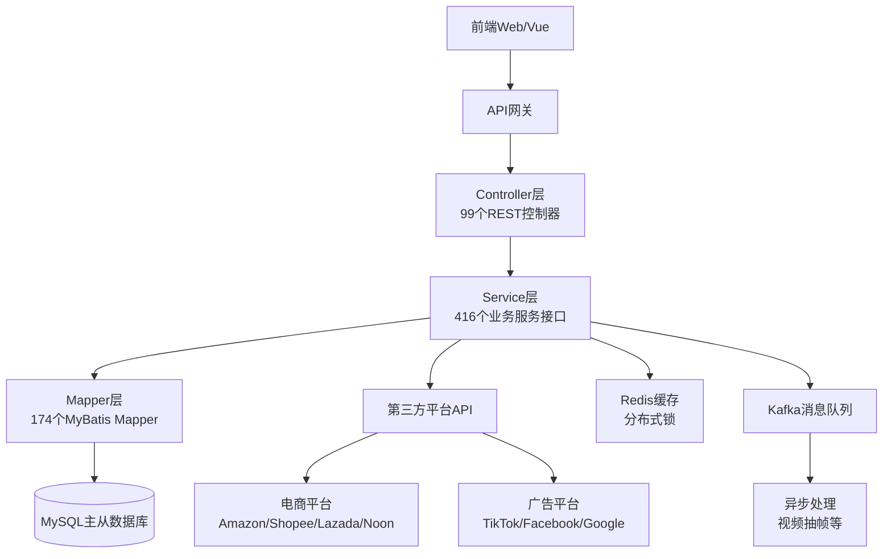
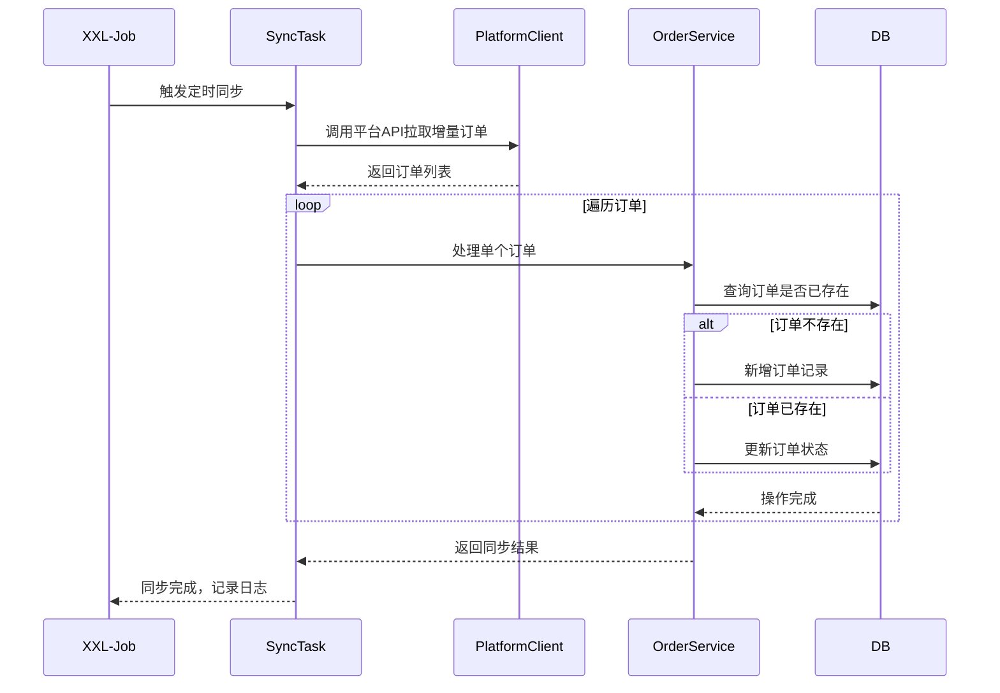
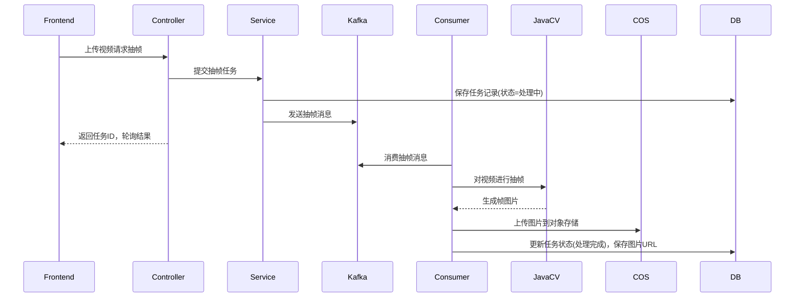
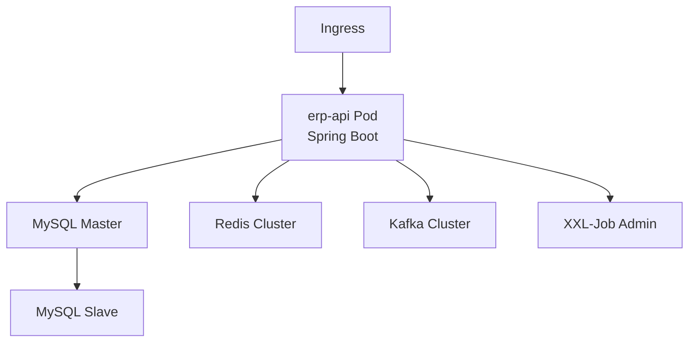

# 【跨境电商ERP系统】项目架构设计文档

版本号：v1.0.0
编写日期：2026-04-07
编写人：Claude
审核人：

---

**修订记录：**

| 版本号 | 修订日期 | 修订人 | 修订内容 |
|--------|----------|--------|----------|
| v1.0.0 | 2026-04-07 | Claude | 初始版本，完整项目架构总结 |

---

## 1. 文档基本信息

本文档是**跨境电商ERP后端API系统**的整体项目架构设计文档，总结了系统的技术选型、分层架构、核心模块、第三方集成等设计决策。

---

## 2. 需求背景

### 2.1 功能需求

为跨境电商卖家提供一套**全链路ERP管理系统**，解决多平台店铺分散管理、库存不准确、广告效果无法统一分析、财务核算困难等问题。

具体需求包括：
- 多电商平台订单自动同步管理
- 多仓库库存供应链管理
- 多平台广告数据聚合与ROI分析
- 供应商与采购管理
- 物流发货集成第三方物流API
- 财务成本与盈亏核算
- 媒体文件（视频/图片）管理

### 2.2 业务价值

- **提升运营效率**：自动化同步多平台订单，减少人工操作
- **降低库存成本**：全链路库存可视可控，避免超卖或缺货
- **优化广告投放**：多维度ROI分析，帮助优化广告投放策略
- **数据驱动决策**：统一数据分析，支持精细化运营

### 2.3 业务范围

系统已在生产环境投入使用，客户：Reva Social Media (https://www.revasocialmedia.com/)

---

## 3. 系统设计

### 3.1 架构设计

整体采用经典的**Spring Boot 分层架构**，遵循MVC模式：



**模块分层说明：**

| 模块 | 职责 | 数量 |
|------|------|------:|
| **Controller** | 接收HTTP请求、参数校验、响应封装 | 99个 |
| **Service** | 核心业务逻辑处理、事务管理 | 416个接口 |
| **Mapper** | 数据库CRUD操作 | 174个 |
| **Entity** | 数据库实体类 | 按业务模块分76个子包 |
| **DTO** | 数据传输对象（请求/响应） | 106个子包 |
| **Task** | XXL-Job定时任务 | 88个 |
| **Client** | 第三方API客户端封装 | 155个类 |
| **Consumer** | Kafka消息消费者 | 异步处理 |

**项目目录结构：**
```
src/main/java/com/szjh/ecommerce/
├── EcommerceApplication.java      # 应用启动类
├── biz/                           # 业务编排层
├── client/                        # 第三方API客户端
├── common/                        # 公共基础类
├── config/                        # Spring配置类
├── consumer/                      # Kafka消费者
├── controller/                    # REST API控制器
├── dto/                           # 数据传输对象
├── entity/                        # 数据库实体
├── enums/                         # 枚举定义
├── mapper/                        # MyBatis Mapper接口
├── service/                       # 业务服务层（按业务模块分包）
│   ├── ad/                        # 广告相关服务
│   ├── order/                     # 订单服务
│   ├── product/                   # 商品服务
│   ├── inventory/                 # 库存服务
│   ├── warehouse/                 # 仓库服务
│   ├── lazada/shopee/tiktok/...  # 各平台服务
│   └── ...
├── task/                          # 定时任务
└── util/                          # 工具类
```

---

### 3.2 核心流程

#### 订单同步核心流程



#### 视频抽帧异步处理流程



---

### 3.3 接口设计

系统采用RESTful API设计，所有接口统一响应格式：

**统一响应格式：**
```json
{
  "code": 200,          // 状态码：200=成功，400=参数错误，403=无权限，500=系统错误
  "message": "success", // 提示信息
  "data": {}            // 返回数据
}
```

**主要接口分组：**

| 模块 | 接口前缀 | 接口数量 | 说明 |
|------|----------|---------:|------|
| 订单管理 | `/order` | ~15个 | 订单查询、订单详情、手动同步 |
| 商品管理 | `/product` | ~12个 | SKU管理、分类管理 |
| 库存管理 | `/inventory` | ~10个 | 库存查询、库存明细、库存变动 |
| 仓库管理 | `/warehouse` | ~8个 | 仓库信息管理 |
| 广告报表 | `/ad` | ~10个 | 广告数据查询、ROI报表 |
| 供应商管理 | `/vendor` | ~8个 | 供应商信息、供应商库存 |
| 用户权限 | `/user` | ~6个 | 用户登录、权限校验 |

完整API文档请访问：https://erp-api.xiaofeilun.cn/erp-api/doc.html#/home

---

### 3.4 依赖说明

**核心技术依赖：**

| 依赖名称 | 版本 | 用途 | Maven 坐标 |
|----------|------|------|------------|
| Spring Boot | 2.5.6 | 应用框架 | `org.springframework.boot:spring-boot-starter-web` |
| MyBatis Plus | 3.5.5 | ORM框架 | `com.baomidou:mybatis-plus-boot-starter` |
| MySQL Connector | - | 数据库驱动 | `mysql:mysql-connector-java` |
| Redis | - | 缓存客户端 | `org.springframework.boot:spring-boot-starter-data-redis` |
| Redisson | 3.24.3 | 分布式锁 | `org.redisson:redisson-spring-boot-starter` |
| Spring Kafka | - | 消息队列 | `org.springframework.kafka:spring-kafka` |
| XXL-Job | 2.3.1 | 定时任务 | `com.xuxueli:xxl-job-core` |
| Spring Security | - | 安全权限 | `org.springframework.boot:spring-boot-starter-security` |
| JWT | 0.9.1 | Token认证 | `io.jsonwebtoken:jjwt` |
| Flyway | 7.1.1 | 数据库迁移 | `org.flywaydb:flyway-core` |
| Knife4j | 4.5.0 | API文档 | `com.github.xiaoymin:knife4j-openapi2-spring-boot-starter` |
| EasyExcel | 3.3.2 | Excel处理 | `com.alibaba:easyexcel` |
| MapStruct | 1.5.5.Final | 对象映射 | `org.mapstruct:mapstruct` |
| Lombok | 1.18.30 | 代码简化 | `org.projectlombok:lombok` |
| Hutool | 5.8.22 | 工具类库 | `cn.hutool:hutool-core` |
| FastJSON2 | 2.0.49 | JSON序列化 | `com.alibaba.fastjson2:fastjson2` |
| JavaCV | 1.5.9 | 视频处理 | `org.bytedeco:javacv-platform` |
| HanLP | portable-1.8.4 | 中文分词 | `com.hankcs:hanlp` |
| Tencent Cloud COS | 5.6.89 | 对象存储 | `com.qcloud:cos_api` |

---

## 4. 功能实现

### 4.1 实现思路

#### 多平台API集成设计

**问题**：需要对接10+不同电商和广告平台，各平台API风格差异大，认证方式各异。

**解决方案**：提炼通用的抽象基类，各平台实现自己的适配层，统一错误处理和重试机制。

```
AbstractApiClient
├── AmazonApiClient
├── ShopeeApiClient
├── LazadaApiClient
├── NoonApiClient
├── TikTokApiClient
└── ...
```

**核心设计点：**
- 统一的请求/错误处理模板方法
- 支持自动重试（Spring Retry）
- 统一日志记录
- 频率控制防止被平台限流

#### 大数据量定时任务优化

**问题**：每日需要同步数十万订单和广告数据，全量同步耗时久，容易OOM。

**解决方案**：
1. **增量同步**：只拉取上次同步后变更的数据
2. **分页拉取**：按页分批拉取，避免一次性加载过多数据
3. **并发控制**：使用线程池并发处理，提高同步速度
4. **断点续传**：记录同步位置，异常重启后可继续

#### 复杂报表查询优化

**问题**：ROI和盈亏报表涉及多表关联聚合，数据量大时查询慢。

**解决方案**：
1. **Redis缓存**：缓存基础数据（如店铺信息、商品信息），减少重复查询
2. **预统计中间表**：定时任务预计算统计数据，查询时直接读取
3. **联合索引优化**：根据查询条件设计合适的联合索引
4. **读写分离**：报表查询走从库，不影响主库业务

#### 异步化处理

**问题**：视频抽帧等IO密集型操作会阻塞请求响应。

**解决方案**：引入Kafka消息队列，将耗时操作异步化：
1. 接口立即返回任务ID
2. 后台异步处理
3. 前端轮询查询处理状态

### 4.2 核心代码说明

| 类名 | 功能描述 | 文件路径 |
|------|----------|----------|
| `EcommerceApplication` | 应用启动入口，开启定时任务、异步、重试 | `com/szjh/ecommerce/EcommerceApplication.java:14` |
| `ShopeeOrderSyncTask` | Shopee订单同步定时任务 | `com/szjh/ecommerce/task/ShopeeOrderSyncTask.java` |
| `RoiReportTask` | ROI报表定时生成任务 | `com/szjh/ecommerce/task/RoiReportTask.java` |
| `VideoFrameExtractConsumer` | Kafka视频抽帧消费者 | `com/szjh/ecommerce/consumer/VideoFrameExtractConsumer.java` |
| `OrderServiceImpl` | 订单业务核心服务 | `com/szjh/ecommerce/service/impl/OrderServiceImpl.java` |
| `RoiReportServiceImpl` | ROI报表计算服务 | `com/szjh/ecommerce/service/roi/RoiReportServiceImpl.java` |
| `ShopeeApiClient` | Shopee平台API客户端 | `com/szjh/ecommerce/client/shopee/ShopeeApiClient.java` |
| `AmazonAdClient` | Amazon广告API客户端 | `com/szjh/ecommerce/client/amazon/AmazonAdClient.java` |

### 4.3 异常处理

**异常处理策略：**

| 场景 | 处理方式 |
|------|----------|
| 参数校验失败 | 返回400错误码，提示具体字段错误 |
| 第三方API调用失败 | 记录详细日志，根据错误类型决定是否重试 |
| 数据不存在 | 返回404错误码，提示资源未找到 |
| 权限不足 | 返回403错误码，提示无权限 |
| 系统异常 | 返回500错误码，记录错误日志 |

**第三方API降级方案：**
- 网络超时：自动重试（配置重试次数）
- API限流：记录日志，延迟下一次同步
- 服务不可用：跳过本次同步，等待下一轮

---

## 5. 数据库设计

### 5.1 整体设计

系统采用Flyway进行数据库版本管理，目前有67个SQL迁移脚本。

**核心业务表分类：**

| 分类 | 说明 | 示例表 |
|------|------|--------|
| **基础数据** | 系统基础配置 | `shop`(店铺), `product`(商品), `sku`(SKU), `warehouse`(仓库) |
| **订单相关** | 订单数据 | `order`(订单), `order_item`(订单项), `order_sync_log`(同步日志) |
| **库存相关** | 库存数据 | `erp_sku_stock_detail`(库存明细), `inventory_flow`(库存流水) |
| **广告相关** | 广告数据 | `aws_ad`(AWS广告), `ad_report`(广告报表), `roi_report`(ROI报表) |
| **供应链** | 供应商采购 | `vendors`(供应商), `purchase_order`(采购单) |
| **财务** | 成本核算 | `shop_daily_cost`(店铺日成本), `currency`(汇率) |
| **系统** | 系统用户权限 | `user`(用户), `role`(角色), `permission`(权限) |

### 5.2 数据迁移

项目使用Flyway进行版本化数据迁移，每次启动自动执行未执行的迁移脚本，不需要手动执行。

---

## 6. 核心业务模块

### 6.1 多平台订单管理

**功能范围：**
- 支持Amazon、Shopee、Lazada、Noon、Shopline、Shopify多平台
- 定时自动增量同步订单
- 订单状态本地维护
- 手动触发同步功能

**核心类：**
- `ShopeeOrderSyncTask` - Shopee订单同步
- `LazadaOrderSyncTask` - Lazada订单同步
- `OrderController` - 订单查询管理

### 6.2 库存仓储管理

**功能范围：**
- 多仓库库存管理
- 库存明细查询
- 库存变动流水
- 月末库存结算
- 旺店通WMS集成

**核心类：**
- `WarehouseController` - 仓库管理
- `ErpSkuStockDetailController` - 库存明细
- `InventoryFlowMonthTask` - 月度库存统计

### 6.3 广告数据分析

**功能范围：**
- 多平台广告数据汇总
- ROI报表计算
- GMV日报统计
- 盈亏报表分析
- 支持按日期/店铺/项目/SKU维度钻取

**支持平台：** Amazon AWS广告、OceanEngine巨量引擎、Google广告

**核心类：**
- `RoiReportController` - ROI报表接口
- `RoiReportTask` - 定时生成报表
- `AwsAdInsightTask` - AWS广告数据同步

### 6.4 供应链与采购管理

**功能范围：**
- 供应商管理
- 采购订单管理
- 供应商库存管理
- AWS采购订单自动同步

### 6.5 财务管理

**功能范围：**
- 店铺日成本管理
- 汇率管理
- 成本核算
- 盈亏计算

### 6.6 物流发货管理

**功能范围：**
- 发货管理
- JNT金蚂蚁物流API集成
- Naqel中东物流（SOAP WSDL）集成
- 运费计算

### 6.7 媒体资产管理

**功能范围：**
- 商品视频抽帧
- 图片存储到腾讯云COS
- TikTok/YouTube/Instagram OAuth授权

**技术亮点：** Kafka异步处理视频抽帧任务

---

## 7. 第三方集成

| 类别 | 集成平台 | 用途 |
|------|---------|------|
| **电商平台** | Amazon SP-API | 订单、广告、财务数据拉取 |
| **电商平台** | Shopee | 订单同步 |
| **电商平台** | Lazada | 订单同步 |
| **电商平台** | Noon | 中东电商订单同步 |
| **电商平台** | Shopify/Shopline | 订单同步与Webhook |
| **社交媒体** | TikTok | OAuth授权、视频查询 |
| **社交媒体** | YouTube/Google | 数据分析、广告集成 |
| **社交媒体** | Facebook/Instagram | API集成 |
| **社交媒体** | Snapchat | 广告集成 |
| **广告平台** | OceanEngine 巨量引擎 | 广告数据分析 |
| **物流** | JNT金蚂蚁 | 物流API集成 |
| **物流** | Naqel | WSDL SOAP服务集成 |
| **云服务** | 腾讯云COS | 对象存储 |
| **任务调度** | XXL-Job | 分布式定时任务 |
| **消息队列** | Kafka | 异步视频处理 |
| **企业通知** | 飞书 Lark | 消息通知 |

---

## 8. 部署架构

**部署方式：** Docker + Kubernetes



**部署信息：**
- **应用端口**：8080
- **上下文路径**：`/erp-api`
- **资源限制**：CPU 2核，内存 4GB
- **健康检查**：Kubernetes Readiness/Liveness 探针
- **API文档地址**：https://erp-api.xiaofeilun.cn/erp-api/doc.html#/home

---

## 9. 测试方案

### 9.1 测试范围

| 测试类型 | 覆盖内容 | 负责人 |
|----------|----------|--------|
| 单元测试 | Service 层核心逻辑 | 开发 |
| 接口测试 | 全部新增/修改接口 | 开发 |
| 功能测试 | 完整业务流程 | 测试 |
| 回归测试 | 关联模块影响范围 | 测试 |

### 9.2 项目统计

| 指标 | 数值 |
|------|------:|
| 总Java文件数 | 2,561 |
| 总代码行数 | 203,224 |
| XML映射文件 | 160 |
| SQL迁移脚本 | 67 |
| REST控制器 | 99 |
| 定时任务 | 88 |
| MyBatis Mapper | 174 |
| 服务接口 | 416 |
| 枚举类型 | 69 |
| Git提交次数 | 11,589 |

---

## 关键词

`Spring Boot` `MyBatis Plus` `MySQL` `Redis` `Kafka` `XXL-Job` `跨境电商` `ERP` `多平台集成` `定时任务` `数据分析` `Docker` `Kubernetes`
