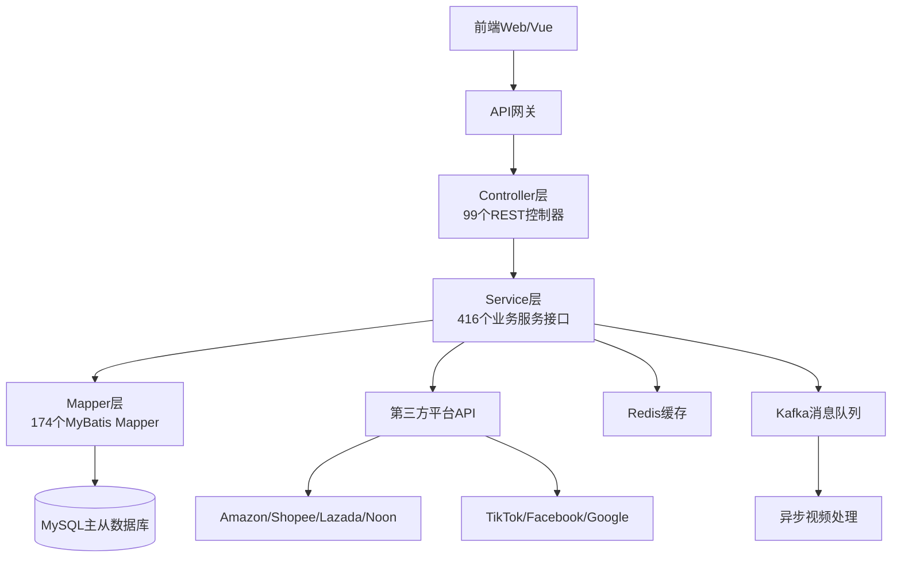

# 项目简历：跨境电商ERP后端系统

---

## 项目基本信息

**项目名称** | 跨境电商ERP系统后端API
-------|-------
**项目规模** | 20万+行代码，2,561个Java文件
**技术架构** | Spring Boot + MyBatis Plus + MySQL + Redis + Kafka
**项目角色** | 后端开发工程师
**开发时长** | 持续迭代开发
**项目地址** | https://gitlab.xiaofeilun.cn/backend/erp-api.git

---

## 项目概述

这是一个**功能完整的跨境电商ERP后端系统**，为跨境电商卖家提供从商品管理、采购、库存、订单、发货、物流到财务数据分析的全链路管理解决方案。系统集成了全球主流电商平台和社交媒体广告平台，支持多店铺、多项目、多供应商协同管理，提供GMV、ROI、成本、盈亏等多维度数据化运营分析。

**核心价值：**
- 帮助跨境电商卖家统一管理多平台订单，提升运营效率
- 全链路库存供应链管理，降低库存成本
- 多维度广告数据分析，优化广告投放ROI
- 自动化订单同步与发货流程，减少人工操作

**当前客户**：Reva Social Media (https://www.revasocialmedia.com/) 已投入生产使用

---

## 技术栈

| 分层 | 技术选型 | 版本 | 用途 |
------|---------|------|------|
| **框架** | Spring Boot | 2.5.6 | 应用框架 |
| **ORM** | MyBatis Plus | 3.5.5 | 数据库访问 |
| **数据库** | MySQL | 8.0 | 主存储 |
| **缓存** | Redis + Redisson | - | 缓存、分布式锁 |
| **消息队列** | Kafka | - | 异步消息处理（视频抽帧等） |
| **任务调度** | XXL-Job | - | 分布式定时任务 |
| **权限控制** | Spring Security + JWT | - | 接口权限认证 |
| **数据库版本** | Flyway | 7.1.1 | 数据库迁移版本管理 |
| **API文档** | Knife4j | - | Swagger增强API文档 |
| **对象存储** | 腾讯云COS | - | 媒体文件存储 |
| **Excel处理** | Alibaba EasyExcel + Apache POI | - | Excel导入导出 |
| **视频处理** | JavaCV | - | 视频抽帧处理 |
| **自然语言** | HanLP | - | 中文分词处理 |
| **对象映射** | MapStruct | - | DTO-Entity转换 |
| **部署** | Docker + Kubernetes | - | 容器化编排部署 |

---

## 项目架构



**项目目录结构：**
```
src/main/java/com/szjh/ecommerce/
├── EcommerceApplication.java      # 应用启动类
├── biz/                           # 业务编排层 (38个接口)
├── client/                        # 第三方API客户端 (155个类)
├── common/                        # 公共基础类
├── config/                        # 配置类 (11个)
├── consumer/                      # Kafka消费者
├── controller/                    # REST控制器 (99个)
├── dto/                           # 数据传输对象 (106个包)
├── entity/                        # 数据库实体 (76个包)
├── enums/                         # 枚举定义 (69个)
├── mapper/                        # MyBatis mapper (174个)
├── service/                       # 业务服务层 (416个接口)
├── task/                          # 定时任务 (88个)
└── util/                          # 工具类 (41个)
```

---

## 核心业务模块

### 1. 多平台订单管理模块
- **功能**：支持Amazon、Shopee、Lazada、Noon、Shopline、Shopify等多平台订单自动同步
- **实现**：通过各平台开放API定时拉取订单数据，维护本地订单状态
- **核心类**：
  - `ShopeeOrderSyncTask` - Shopee订单同步定时任务
  - `LazadaOrderSyncTask` - Lazada订单同步定时任务
  - `OrderController` - 订单查询与管理REST接口
- **亮点**：支持批量同步、状态机流转、失败重试机制

### 2. 库存仓储管理模块
- **功能**：多仓库库存管理、库存明细、月末结算、库存变动日志、集成旺店通WMS
- **核心类**：
  - `WarehouseController` - 仓库管理接口
  - `ErpSkuStockDetailController` - 库存明细查询
  - `InventoryFlowMonthTask` - 月度库存统计任务
  - `WdtWarehouseReceiptTask` - 旺店通入库同步
- **亮点**：支持库存预警、批次管理、效期管理

### 3. 广告数据分析模块
- **功能**：多平台广告数据汇总、ROI报表、GMV日报、盈亏报表
- **支持平台**：Amazon AWS广告、OceanEngine巨量引擎、Google广告
- **核心类**：
  - `AdReportController` - 广告报表查询接口
  - `RoiReportController` - ROI报表接口
  - `RoiReportTask` - ROI报表定时生成
  - `ProfitLossReportTask` - 盈亏报表生成
  - `AwsAdInsightTask` - AWS广告见解同步
- **亮点**：多维度聚合分析，支持按日期、店铺、项目、SKU维度钻取

### 4. 供应链与采购管理
- **功能**：供应商管理、采购订单、供应商库存管理、AWS采购自动同步
- **核心类**：
  - `VendorsController` - 供应商管理接口
  - `VendorsStorageController` - 供应商库存
  - `AwsPurchaseOrderTask` - AWS采购订单同步

### 5. 财务管理模块
- **功能**：店铺日成本管理、汇率管理、成本核算、盈亏计算
- **核心类**：
  - `ShopDailyCostController` - 店铺日成本接口
  - `CurrencyController` - 汇率管理

### 6. 物流发货管理
- **功能**：发货管理、第三方物流API集成、运费计算
- **集成物流**：JNT金蚂蚁物流、Naqel中东物流（SOAP WSDL集成）
- **核心类**：`DeliveryController` - 发货管理接口

### 7. 媒体资产管理
- **功能**：商品视频抽帧、图片存储、OAuth授权社交媒体平台
- **支持平台**：TikTok、YouTube、Facebook、Instagram、Snapchat
- **技术亮点**：使用Kafka异步处理视频抽帧任务，腾讯云COS存储

---

## 第三方集成

| 类别 | 集成平台 | 用途 |
------|---------|------|
| **电商平台** | Amazon SP-API | 订单、广告、财务数据拉取 |
| **电商平台** | Shopee | 订单同步 |
| **电商平台** | Lazada | 订单同步 |
| **电商平台** | Noon | 中东电商订单同步 |
| **电商平台** | Shopify/Shopline | 订单同步与Webhook |
| **社交媒体** | TikTok | OAuth授权、视频查询 |
| **社交媒体** | YouTube/Google | 数据分析、广告集成 |
| **社交媒体** | Facebook/Instagram | API集成 |
| **社交媒体** | Snapchat | 广告集成 |
| **广告平台** | OceanEngine 巨量引擎 | 广告数据分析 |
| **物流** | JNT金蚂蚁 | 物流API集成 |
| **物流** | Naqel | WSDL SOAP服务集成 |
| **云服务** | 腾讯云COS | 对象存储 |
| **任务调度** | XXL-Job | 分布式定时任务 |
| **消息队列** | Kafka | 异步视频处理 |
| **企业通知** | 飞书 Lark | 消息通知 |
| **翻译** | Microsoft Translator | 多语言翻译 |

---

## 我在项目中承担的工作

> （此处可根据实际情况填写）

- 负责xxx模块的需求分析、设计与开发
- 参与系统架构设计与技术选型
- 对接xxx电商平台API，完成订单同步功能开发
- 优化xxx报表查询性能，将响应时间从xxx降低到xxx
- 修复生产环境xxx问题，提升系统稳定性
- 参与数据库表结构设计与索引优化

---

## 项目亮点与技术挑战

### 1. 多平台集成架构
**挑战**：需要对接10+不同电商和广告平台，各平台API风格差异大，认证方式各异
**解决方案**：提炼通用的`ApiClient`抽象基类，各平台实现自己的适配层，统一错误处理和重试机制

### 2. 大数据量定时任务优化
**挑战**：每日需要同步数十万订单和广告数据，全量同步耗时久
**解决方案**：采用增量同步 + 分页拉取 + 并发控制，避免一次性加载过多数据导致OOM

### 3. 复杂报表查询性能优化
**挑战**：ROI和盈亏报表涉及多表关联聚合，数据量大时查询慢
**解决方案**：
- 利用Redis缓存基础数据
- 预统计生成中间表，定时任务预计算
- 合理设计联合索引降低查询延时

### 4. 异步化处理
**挑战**：视频抽帧等IO密集型操作会阻塞请求响应
**解决方案**：引入Kafka消息队列，将耗时操作异步化，前端轮询获取处理结果

### 5. 工程化实践
- Flyway数据库版本管理，支持团队协作开发
- Docker + Kubernetes容器化部署，支持弹性扩缩容
- Knife4j自动生成API文档，前后端协作便捷
- 动态数据源支持主从分离，提升读写性能

---

## 部署信息

- **应用端口**：8080
- **上下文路径**：`/erp-api`
- **API文档地址**：`https://erp-api.xiaofeilun.cn/erp-api/doc.html#/home`
- **资源限制**：CPU 2核，内存 4GB
- **健康检查**：Kubernetes Readiness/Liveness探针

---

## 项目统计

| 指标 | 数值 |
------|------:|
| 总Java文件数 | 2,561 |
| 总代码行数 | 203,224 |
| XML映射文件 | 160 |
| SQL迁移脚本 | 67 |
| REST控制器 | 99 |
| 定时任务 | 88 |
| MyBatis Mapper | 174 |
| 服务接口 | 416 |
| 枚举类型 | 69 |
| Git提交次数 | 11,589 |

---

## 关键词

`Spring Boot` `MyBatis Plus` `MySQL` `Redis` `Kafka` `XXL-Job` `跨境电商` `ERP` `多平台集成` `定时任务` `数据分析` `Docker` `Kubernetes`

---

*生成日期：2026-04-07*
