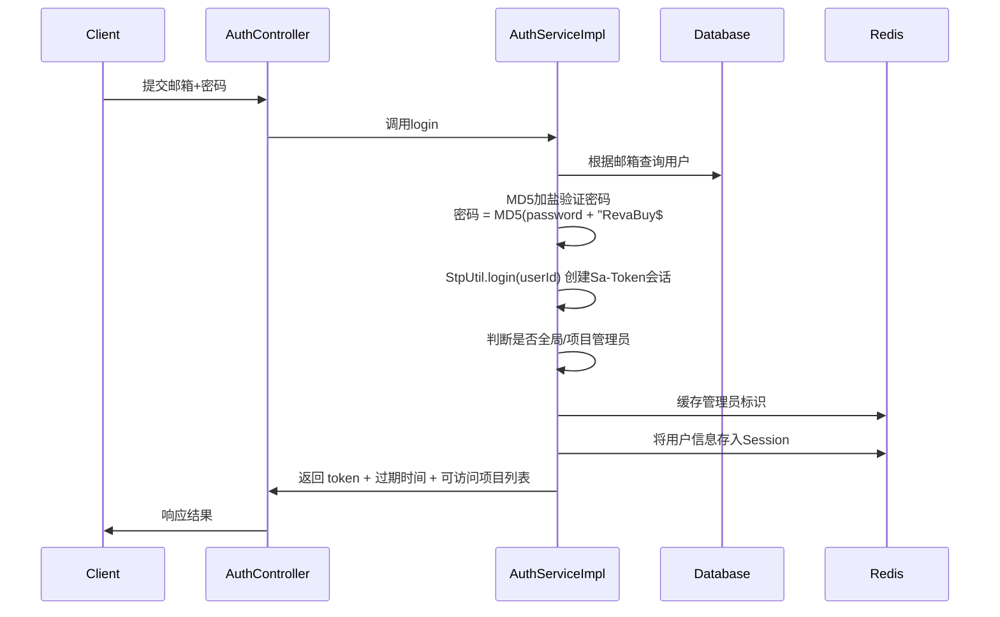
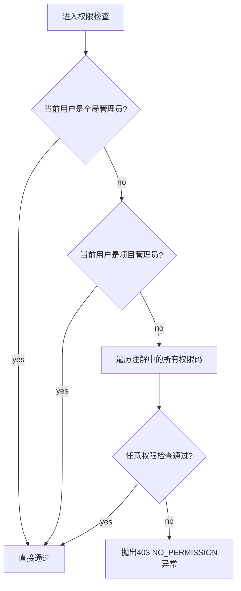

# 登录鉴权与权限控制技术设计文档

| 版本 | 日期 | 开发人员 | 修订说明 |
|------|------|----------|----------|
| v1.0 | 2026-03-17 | lgr | 初始版本，完整梳理登录鉴权、角色权限管理、组织架构数据权限控制 |

---

## 1. 系统概述

登录鉴权与权限控制模块是项目的基础安全模块，基于 **Sa-Token** 框架实现，采用**项目级隔离的RBAC（Role-Based Access Control）访问控制模型**，并额外提供**树形组织架构数据权限控制**，支持多级管理员体系。

### 1.1 主要功能

- **用户认证**：支持账号密码登录、飞书扫码登录、邀请注册
- **RBAC权限模型**：基于角色的访问控制，角色和权限按项目隔离
- **多级管理员**：支持全局管理员、项目管理员两级管理体系
- **数据权限**：基于组织树形结构的数据访问权限控制
- **缓存优化**：应用启动预加载缓存，数据变更即时更新
- **注解驱动**：使用注解灵活标记接口需要的权限和数据范围
- **异步透传**：使用 TransmittableThreadLocal 支持异步上下文透传

### 1.2 整体架构

```
┌─────────────────────────────────────────────────────────────┐
│                         请求入口                                 │
└───────────────────────────────────────────────┬─────────────────┘
                                                │
                                                ▼
                                      ┌───────────────────┐
                                      │   白名单路径判断  │
                                      └─────────┬─────────┘
                                                │
                                 ┌────────────┘        ┌─────────────┐
                                 │ 是                否 │             │
                                 ▼                      ▼             │
                              直接放行             ┌───────────────────┐  │
                                               │ SaTokenAsyncInterceptor │  │
                                               │  1. 检查登录状态       │  │
                                               │  2. 设置用户上下文       │  │
                                               └─────────┬─────────────┘  │
                                                         │             │
                                                         ▼             │
                                                  ┌───────────────┐     │
                                                  │ 到达Controller │     │
                                                  └───────┬───────┘     │
                                                          │             │
                                      ┌───────────────────┴───────────────┘             │
                                      │         方法有@ProjectPermission?              │
                                      └───────────────────┬───────────────┘             │
                                                          │                         │
                               ┌─────────────────┐        │        ┌─────────────────┐  │
                               │ 是           否 │        │        │ 有@HierarchyLimit? │  │
                               ▼                 ▼        ▼        └─────┬───────┘  │
                ┌──────────────────────────┐                │             │             │  │
                │ ProjectPermissionHandler │                │ 否      是 │             │  │
                │      权限码校验          │                │             ▼             │  │
                └───────────┬────────────┘                │     ┌──────────────────┐  │  │
                            │                             │     │ HierarchyLimitAspect│  │  │
                            ▼                             │     │  组织架构ID过滤    │  │  │
                      权限检查通过?                       │     └─────────┬──────────────┘  │  │
                        ┌───┴───┐                      │               │                 │  │
                       是       否                      │               ▼                 │  │
                       │         ▼                      │           校验通过?              │  │
                       ▼    返回403                   │           ┌───┴───┐              │  │
                    执行                           是    否          │       │              │  │
                                                     ▼         执行 返回403              │  │
                                                         │                               │  │
                                                         └─────────────────────────────────┘  │
┌────────────────────────────────────────────────────────────────────────────────────────────┘
│  不管结果如何，finally 清理 OpUserThreadLocal 防止内存泄漏
└────────────────────────────────────────────────────────────────────────────────────────────────
```

---

## 2. 数据模型设计

### 本章列出所有相关表结构和实体类。

### 2.1 AdvertiserUser (用户主表)

**表名**: `advertiser_user`
**实体**: `com.szjh.ecommerce.entity.AdvertiserUser`

| 字段名 | 类型 | 说明 |
|--------|------|------|
| `id` | int | 主键，自增 |
| `email` | varchar | 登录邮箱，唯一 |
| `password` | varchar | MD5加密密码 |
| `username` | varchar | 用户昵称 |
| `mobile` | varchar | 手机号 |
| `avatar` | varchar | 头像URL |
| `is_global_admin` | tinyint | 是否全局管理员：0=否，1=是 |
| `status` | tinyint | 用户状态：0=禁用，1=正常 |
| `create_time` | datetime | 创建时间 |
| `update_time` | datetime | 更新时间 |

---

### 2.2 SysRole (角色表)

**表名**: `sys_role`
**实体**: `com.szjh.ecommerce.entity.user.SysRole`

| 字段名 | 类型 | 说明 |
|--------|------|------|
| `id` | bigint | 主键，自增 |
| `project_id` | int | **所属项目ID，按项目隔离 |
| `role_code` | varchar | 角色编码，唯一 |
| `role_name` | varchar | 角色名称 |
| `role_desc` | varchar | 角色描述 |
| `status` | tinyint | 状态：0=禁用，1=启用 |
| `create_time` | datetime | 创建时间 |
| `update_time` | datetime | 更新时间 |
| `create_by` | int | 创建人ID |
| `update_by` | int | 更新人ID |

> **特点**：角色是按项目划分，不同项目的角色相互隔离。特殊角色 `ProjectAdmin 为项目管理员，拥有该项目所有权限。

---

### 2.3 SysPermission (权限表)

**表名**: `sys_permission`
**实体**: `com.szjh.ecommerce.entity.user.SysPermission`

| 字段名 | 类型 | 说明 |
|--------|------|------|
| `id` | bigint | 主键，自增 |
| `permission_code` | varchar | **权限编码，全局唯一，如 `setting:role` |
| `permission_name` | varchar | 权限名称 |
| `type` | varchar | 权限类型：route=菜单路由，button=按钮，api=接口 |
| `parent_id` | bigint | 父权限ID，构建树形菜单 |
| `sort` | int | 排序权重 |
| `status` | tinyint | 状态：0=禁用，1=启用 |
| `create_time` | datetime | 创建时间 |
| `update_time` | datetime | 更新时间 |

> **树形结构**：通过 parent_id 构建前端路由菜单树。

---

### 2.4 SysUserRole (用户-角色关联表)

**表名**: `sys_user_role`
**实体**: `com.szjh.ecommerce.entity.user.SysUserRole`

| 字段名 | 类型 | 说明 |
|--------|------|------|
| `id` | bigint | 主键，自增 |
| `project_id` | int | 项目ID |
| `user_id` | int | 用户ID |
| `role_id` | bigint | 角色ID |
| `status` | tinyint | 状态：0=禁用，1=启用 |

> **多对多关系**：一个用户在一个项目中可以拥有多个角色。

---

### 2.5 SysRolePermission (角色-权限关联表)

**表名**: `sys_role_permission`
**实体**: `com.szjh.ecommerce.entity.user.SysRolePermission`

| 字段名 | 类型 | 说明 |
|--------|------|------|
| `id` | bigint | 主键，自增 |
| `project_id` | int | 项目ID |
| `role_id` | bigint | 角色ID |
| `permission_id` | bigint | 权限ID |
| `status` | 状态：0=禁用，1=启用 |

> **多对多关系**：一个角色可以拥有多个权限。

---

### 2.6 MediaProjectUser (用户-项目关联表)

**表名**: `media_project_user`
**实体**: `com.szjh.ecommerce.entity.MediaProjectUser`

| 字段名 | 类型 | 说明 |
|--------|------|------|
| `id` | bigint | 主键，自增 |
| `project_id` | int | 项目ID |
| `user_id` | int | 用户ID |
| `status` | tinyint | 状态：0=禁用，1=启用 |

> 用户只有加入项目才能访问该项目。

---

### 2.7 MediaHierarchy (组织架构表)

**表名**: `media_hierarchy`
**实体**: `com.szjh.ecommerce.entity.hierarchy.MediaHierarchy`

| 得字段名 | 类型 | 说明 |
|--------|------|------|
| `id` | bigint | 主键，自增 |
| `project_id` | int | 所属项目ID |
| `name` | varchar | 组织节点名称 |
| `arch` | int | 层级排序或父ID |
| `level` | tinyint | 层级：1=架构，2=子项 |
| `parent_id` | bigint | 父节点ID |
| `parent_node_id` | bigint | 子项关联上级架构ID |
| `path` | varchar | **祖先路径，格式：`-1-3-5-` |
| `is_tail` | tinyint | 是否最小叶子节点 |
| `is_deleted` | tinyint | 逻辑删除 |
| `create_time` | datetime | 创建时间 |
| `update_time` | datetime | 更新时间 |

> **路径设计说明**：path字段存储从根节点到当前节点的所有祖先ID，用 `-` 分隔，利用前缀匹配可以快速找出一个节点的**所有后代节点**，用于数据权限过滤。

---

### 2.8 AdHierarchyRelation (用户-组织架构关联表)

**表名**: `ad_hierarchy`
**实体**: `com.szjh.ecommerce.entity.user.AdHierarchyRelation`

| 字段名 | 类型 | 说明 |
|--------|------|------|
| `id` | bigint | 主键，自增 |
| `user_id` | int | 用户ID |
| `hierarchy_id` | int | 组织架构节点ID |
| `project_id` | int | 项目ID |
| `is_parent` | tinyint | 是否父组织架构 |
| `status` | tinyint | 状态：0=禁用，1=启用 |

> 用户可以关联多个组织架构节点，拥有这些节点及其后代节点的数据访问权限。

---

### 2.9 SysUserInvite (用户邀请记录表)

**表名**: `sys_user_invite`
**实体**: `com.szjh.ecommerce.entity.user.SysUserInvite`

| 字段名 | 类型 | 说明 |
|--------|------|------|
| `id` | bigint | 主键，自增 |
| `project_id` | int | 项目ID |
| `role_ids` | varchar | 分配的角色ID列表 |
| `org_ids` | varchar | 分配的组织架构ID列表 |
| `token` | varchar | 邀请token |
| `invite_url` | varchar | 邀请注册链接 |
| `email` | varchar | 被邀请人邮箱 |
| `create_by` | int | 邀请人ID |
| `status` | tinyint | 状态：0=未使用，1=已使用 |
| `create_time` | datetime | 创建时间 |

---

## 3. 登录流程

### 3.1 普通登录流程 (`POST /auth/login)

1. **入口**: `AuthController.login()`



**要点说明**:
- 密码加密：MD5(password + 固定盐值 `"RevaBuy$#"`)
- 登录会话由 Sa-Token 管理，token 存储在 Redis
- 如果是全局管理员，缓存 `auth:user:admin:{userId} = "true"
- 如果用户是某些项目的管理员，分别缓存 `auth:project:admin:{projectId}:{userId} = "true"

---

### 3.2 飞书扫码登录流程 (`GET /auth/lark/login`)

1. 走飞书流程：
- 通过飞书飞书开放API获取用户信息
- 如果飞书用户已经绑定账号，流程同普通登录
- 如果未绑定，返回 `needBind` 状态，前端跳转绑定页面
- 用户绑定后完成登录

---

### 3.3 邀请注册流程 (`POST /auth/register`)

1. 验证邮箱验证码
2. 创建用户，密码MD5加密
3. 如果是邀请注册，根据邀请记录自动：
   - 将用户加入项目（添加 `media_project_user`
   - 分配角色（添加 `sys_user_role`）
   - 分配组织架构（添加 `ad_hierarchy_relation`）
   - 重建缓存
4. 创建登录会话
5. 返回token

---

## 4. 认证拦截与用户上下文

### 4.1 SaTokenAsyncInterceptor

所有非白名单请求都会经过这个拦截器：

```java
// 核心流程：
1. 检查 StpUtil.isLogin() → 未登录返回401
2. 从 Sa-Token Session 获取用户信息
3. 将用户信息、用户ID、项目ID设置到 OpUserThreadLocal
4. 放行
5. finally: 清理 ThreadLocal 防止内存泄漏
```

**为什么用 `TransmittableThreadLocal` 而不是普通 ThreadLocal？
- 支持异步线程透传用户上下文，异步任务也能拿到当前登录用户信息

### 4.2 OpUserThreadLocal 工具类

提供静态方法快速获取当前请求的上下文：
- `OpUserThreadLocal.getId()` → 当前用户ID
- `OpUserThreadLocal.getProjectId()` → 当前请求的项目ID（从Header获取）
- `OpUserThreadLocal.get()` → 完整用户对象

---

## 5. 接口权限控制 (`@ProjectPermission`)

### 5.1 注解定义

使用注解标记接口需要哪些权限码才能访问：

```java
@PostMapping("/permission/set")
@ApiOperation("设置角色权限")
@ProjectPermission({"setting:role:edit_permission"})
public Result<?> permissionSet(@RequestBody @Valid RolePermissionSetDTO rolePermissionSetDTO) {
    return sysManagerService.permissionSet(rolePermissionSetDTO);
}
```

**注解参数**:
- `value` - 需要的权限码列表，只要满足任意一个即可通过

### 5.2 权限检查流程 (`ProjectPermissionHandler`)



**权限码规则**:
- 实际存储权限格式：`{permissionCode}:{projectId}`
- 例如权限码和项目ID拼接，实现项目间隔离
- 不同项目的同一个权限码相互不冲突

### 5.3 跳过权限检查

使用 `@IgnoreProjectAuth` 注解标记不需要项目权限检查的方法。

---

## 6. 组织架构数据权限控制 (`@HierarchyLimit`)

### 6.1 问题背景

项目数据是按组织架构树形结构组织的（例如：客户 → 账号 → 推广计划 ...，不同用户只能看到自己有权限的组织架构，需要在查询的时候自动过滤。

### 6.2 注解定义

```java
@Target({ElementType.METHOD})
@Retention(RetentionPolicy.RUNTIME)
public @interface HierarchyLimit {
    // 要注入到 DTO 的字段名，该字段存放过滤后的组织ID列表
    String[] param() default {"hierarchyItemIds"};

    // 是否严格校验：true=前端传入不可见ID就抛异常；false=自动过滤
    boolean strict() default true;

    // 链路参数名，参数值为1时跳过校验（竞争对手分析特殊场景）
    String chainName() default "competitorType";
}
```

### 6.3 使用示例

```java
@PostMapping("/list")
@HierarchyLimit(param = "archIds")
public Result<?> pageList(@RequestBody @Valid MediaSearchDTO searchDTO) {
    // searchDTO.archIds 已经被自动替换为用户可见的组织ID列表
    return mediaManagerService.pageList(searchDTO);
}
```

### 6.4 权限检查流程 (`HierarchyLimitAspect`)

```mermaid
flowchart TD
    A[进入AOP拦截] --> B{是全局管理员?}
    B -- yes --> Z[直接放行]
    B -- no --> C{是项目管理员?}
    C -- yes --> Z[直接放行]
    C -- no --> D{检查chain参数=1?}
    D -- yes --> Z[直接放行]
    D -- no --> E[从Redis获取用户可见组织架构缓存]
    E --> F{缓存为空?}
    F -- yes --> G[重建缓存<br/>查询数据库重新计算]
    G --> E
    F -- no --> H{重建后还是空?]
    H -- yes --> I[抛出异常: 您没有关联任何组织架构权限]
    H -- no --> J[获取请求参数中的组织ID列表]
    J --> K[用用户缓存的可见ID集合做交集过滤]
    K --> L{strict=true 严格模式?]
    L -- yes --> M{前端传入了不可见ID?]
    M -- yes --> I[抛出异常: 越权的组织架构访问]
    M -- no --> N[替换参数，放行]
    L -- no --> N
    N --> Z[放行执行]
```

### 6.5 权限继承原理

利用 `MediaHierarchy.path 字段实现**权限自动继承：

1. ：

- 用户关联了某个父节点 → 就自动拥有该节点下所有子孙节点访问权限
- 查询原理：`path LIKE "%-{nodeId}-%" → 找出所有包含该节点ID的后代
- 一次性查出所有后代节点，收集ID存入Redis缓存

### 6.6 缓存设计

缓存Key：
```
hierarchy:project:project:{projectId}:user:{userId}
```
- 缓存内容：该用户可见的所有组织架构ID集合，JSON数组格式
- 过期时间：30天
- 用户组织变更时自动重建缓存

---

## 7. 缓存体系设计

### 本文档前面讲清楚 **缓存初始化来源和更新机制。

### 7.1 缓存Key总结表

| 缓存Key | 内容说明 | 数据来源 | 过期时间 | 生效环境 |
|---------|---------|---------|---------|----------|
| `star-api:auth:permission:tree:global` | 全局权限路由树 | 从 sys_permission 构建树形结构 | 永久 | 全环境 |
| `star-api:auth:admin:permission:tree:global` | 管理员路由树 | 同上，所有节点默认选中 | 永久 | 全环境 |
| `star-api:auth:role:perms:{projectId}:{roleId}` | 角色权限码列表 | 从 sys_role_permission 查询 | 10年 | 生产预加载 |
| `star-api:auth:user:admin:{userId}` | 是否全局管理员 | 登录时根据用户表判断 | 随token过期 | 全环境 |
| `star-api:auth:project:admin:{projectId}:{userId}` | 是否项目管理员 | 用户加入项目时设置 | 30天 | 全环境 |
| `star-api:auth:user:roles:project:{projectId}:user:{userId}` | 用户在项目中的角色ID列表 | 查询 sys_user_role |  |  |  |  |
| `star-api:auth:user:perms:{userId}` | 用户聚合权限 |  |  |  |
| `star-api:hierarchy:project:project:{projectId}:user:{userId}` | 用户可见组织架构ID列表 | 查询 ad_hierarchy 计算 | 30天 | 全环境 |

### 7.2 缓存初始化（仅生产环境）

`RolePermissionCacheLoader` ：

```java
@PostConstruct
public void initRolePermissions() {
    // 1. 构建全局路由树，缓存
    List<SysPermissionTreeVO> tree = listPermissionTree(0, 0L);
    redisClient.set(routeTreeKey, JsonUtil.to(tree), -1);

    // 2. 构建管理员路由树，缓存
    List<SysPermissionTreeVO> adminTree = listPermissionTree(0, 1L);
    redisClient.set(adminRouteTreeKey, JsonUtil.to(adminTree), -1);

    // 3. 查询所有角色权限，按 projectId + roleId 分别缓存
    List<RolePermissionLoaderVO> allRolePerms = authMapper.getAllRolePermissions();
    // 分组后逐个写入Redis，过期10年
}
```

> 开发环境没有预加载，第一次访问路由树的时候动态加载并缓存。

### 7.3 缓存更新策略

#### 当数据变更时缓存更新：

| 变更场景 | 更新操作 |
|---------|---------|
| **角色权限修改 | 直接更新该角色权限缓存 `auth:role:perms ，然后删除该角色下所有用户的用户权限缓存 |
| **用户添加/移除角色 | 更新该用户在项目的角色列表缓存，删除用户权限缓存 |
| **用户组织架构变更 | 立即重建该用户组织架构缓存 |
| **邀请用户加入项目 | 如果是项目管理员，设置项目管理员缓存；更新角色列表缓存；重建组织缓存 |
| **删除角色 | TODO: 当前代码注释提示需要更新，但目前未实现 |

#### 代码示例（权限设置接口：

```java
// 更新角色权限后，更新缓存
String rolePermsKey = CacheUtil.Auth.getRolePerms() + projectId + ":" + roleId;
List<String> perms = permissions.stream().map(SysPermission::getPermissionCode).toList();
redisClient.set(rolePermsKey, JsonUtil.to(perms), 10年);

// 删除该角色下所有用户的权限缓存，触发下次访问重新加载
List<SysUserRole> userRoles = sysUserRoleService.list(...);
for (SysUserRole userRole : userRoles) {
    String userPermKey = CacheUtil.Auth.getUserPerms() + userRole.getUserId();
    redisClient.del(userPermKey);
}
```

#### 用户组织架构变更后重建：

```java
private void rebuildUserHierarchyCache(Integer projectId, Integer userId) {
    // 1. 查询用户直接关联的节点
    // 2. 查询所有后代节点（利用 path like 查询
    // 3. 收集所有可见ID，写入Redis覆盖旧缓存
}
```

---

## 8. 核心流程时序图

### 8.1 用户访问项目权限路由

```mermaid
sequenceDiagram
    participant Frontend->>
    participant Client
    Client->>AuthController
    AuthController->>Redis: 检查是否全局管理员？
    alt 是全局管理员
        Redis->>AuthController: 是全局管理员
        AuthController->>Redis: 读取全局路由树缓存
        Redis->>AuthController: 返回路由树
    else 不是
        Client->>AuthController: 检查项目管理员？
        alt 是项目管理员
            Redis->>AuthController: 是项目管理员
            AuthController->>Redis: 返回全部路由树
        else 普通用户
            AuthController
            Redis->>Redis: 获取用户在项目的所有角色ID
            Redis->> for each roleId:
                读取角色权限缓存 -> 合并所有权限码
            AuthController->> 标记路由树勾选状态
        end
    end
    AuthController->>Client: 返回前端可访问的路由树
```

---

### 8.2 查询带组织架构权限的接口

```mermaid
sequenceDiagram
    Client->>Controller: GET /media/list archIds=[1,2,3]
    Controller->>HierarchyLimitAspect: 进入AOP切面
    HierarchyLimitAspect->>Redis: 检查全局/项目管理员？
    alt 管理员
        HierarchyLimitAspect->>Controller: 直接放行，不修改参数
    else 普通用户
        HierarchyLimitAspect->>Redis: 获取缓存用户可见组织ID
        alt 缓存不存在
            HierarchyLimitAspect->>Database: 查询关联关系，重建缓存
            Database->>HierarchyCache
            Redis: 写入缓存
        end
        HierarchyLimitAspect->> 过滤 archIds 只保留用户可见的
        HierarchyLimitAspect->> 替换方法参数中的 archIds
        HierarchyLimitAspect->>Controller: 放行
    end
    Controller->>Service: 使用过滤后的 archIds 查询
    Service->>Database: WHERE id IN (过滤后的ID列表
    Database->>Service: 返回结果
    Service->>Controller: 返回结果
    Controller->>Client: 返回数据
```

---

## 9. 核心代码文件结构

| 功能模块 | 文件路径 | 说明 |
|---------|---------|------|
| **登录接口 | `com.szjh.ecommerce.controller.AuthController` | 登录/登出/飞书登录/注册/获取路由 |
| **认证服务 | `com.szjh.ecommerce.service.user.impl.AuthServiceImpl` | 登录流程实现 |
| **角色管理接口 | `com.szjh.ecommerce.controller.RoleManagerController` | 角色列表/新增/复制/删除/邀请用户 |
| **角色管理实现 | `com.szjh.ecommerce，role.RoleManagerServiceImpl` | 角色管理业务逻辑 |
| **权限设置 | `com.szjh.ecommerce.service.sys.impl.SysManagerServiceImpl` | 为角色分配权限 |
| **Sa-Token配置 | `com.szjh.ecommerce.config.SaTokenConfig` | Sa-Token框架配置 |
| **登录拦截器 | `com.szjh.ecommerce，interceptor.SaTokenAsyncInterceptor` | 请求登录检查，上下文设置 |
| **权限注解 | `com.szjh.ecommerce，interceptor.ProjectPermission` | 项目权限注解定义 |
| **权限处理器 | `com.szjh.ecommerce，handler.auth.ProjectPermissionHandler` | 权限检查切面实现 |
| **组织权限注解 | `com.szjh.ecommerce，handler.hierarchy.HierarchyLimit` | 组织架构限制注解 |
| **组织权限切面 | `com.szjh.ecommerce，handler.hierarchy，interceptor，HierarchyLimitAspect | 组织架构权限检查实现 |
| **缓存预加载 | `com.szjh.ecommerce，RolePermissionCacheLoader | 启动预加载权限 |
| **用户上下文 | `com.szjh.ecommerce，util.OpUserThreadLocal` | ThreadLocal存储上下文 |
| **缓存Key定义 | `com.szjh.ecommerce，util.CacheUtil` | 所有缓存Key的定义 |

---

## 10. 设计特点总结

1. **三级权限控制**：认证 → 接口权限 → 数据权限三层拦截，安全性高
2. **项目隔离**：所有角色权限数据都按项目隔离，支持多项目多租户
3. **两级管理员**：全局管理员拥有所有权限，项目管理员拥有项目所有权限
4. **树形数据权限继承**：用户绑定父节点自动继承所有子孙权限
5. **高性能缓存**：生产环境预加载，修改时即时更新，开发环境懒加载
5. **分布式支持**：所有状态存储Redis，支持水平扩展
6. **注解驱动开发**：接口只需要加个注解就能实现权限控制，代码侵入小
7. **异步支持**：TransmittableThreadLocal 支持异步线程上下文透传
8. **邀请机制**：支持链接邀请，自动分配角色和组织架构，开箱即用

---

## 11. 待改进点

- 删除角色后未自动清理相关用户缓存，需要手动等待过期
- 全量缓存需要重新预加载（生产环境），目前只能等过期自然淘汰
- 开发环境不预加载，第一次访问需要动态生成缓存，响应稍慢