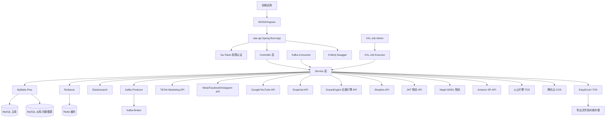

# star-api 项目架构分析文档

> 本文档基于项目代码分析自动生成，完整描述了 star-api 项目的整体架构。

---

## 目录

1. [文档基本信息](#1-文档基本信息)
2. [项目概述](#2-项目概述)
3. [技术栈选型](#3-技术栈选型)
4. [架构设计](#4-架构设计)
   - 4.1 整体分层架构
   - 4.2 模块划分
   - 4.3 技术架构图
5. [核心业务模块](#5-核心业务模块)
6. [数据库设计](#6-数据库设计)
7. [第三方集成](#7-第三方集成)
8. [部署配置](#8-部署配置)
9. [总结](#9-总结)

---

## 1. 文档基本信息

```
# 【star-api 全栈架构】技术文档

版本号：v1.0.0
编写日期：2026-04-07
编写人：Claude Code
项目名称：star-api (E-commerce Platform API)
```

**修订记录：**

| 版本号    | 修订日期       | 修订人    | 修订内容        |
| ------ | ---------- | ------ | ----------- |
| v1.0.0 | 2026-04-07 | Claude | 初始版本，完整架构分析 |

---

## 2. 项目概述

### 2.1 项目简介

海外达人营销线索平台——问我(digi star)
项目概述：面向品牌出海场景的海外社媒数据采集与智能运营的SaaS平台，围绕 TikTok、Facebook、Instagram、YouTube 等平台构建统一的数据接入、线索归集、消息会话、直播监控、竞品追踪与数据分析能力，支持私信、广告、表单、直播等多来源数据的实时接入、定时同步与集中治理，提升营销数据获取效率与运营转化能力


star-api 是一个国际化电商广告管理平台后端 API 服务，主要面向海外营销业务，集成了多个主流社交媒体平台的广告投放、线索管理、数据分析功能。

从 git commit 历史来看，项目核心功能聚焦在：
- 多平台广告账户授权与数据同步
- 线索(Clue)数据抓取与管理
- 广告效果数据分析与报表导出
- 电商订单与物流管理集成

### 2.2 目标用户

- 广告营销人员
- 电商运营人员
- 数据分析人员

### 2.3 已知用户案例

- [Reva Social Media](https://www.revasocialmedia.com/)
- [Reva Social Media Portal](https://portal.revasocialmedia.com/)

---

## 3. 技术栈选型

### 3.1 核心框架

| 技术           | 版本       | 说明      |
| ------------ | -------- | ------- |
| Java         | 17       | 开发语言    |
| Spring Boot  | 2.5.6    | 应用框架    |
| Spring Cloud | 2020.0.6 | 微服务基础设施 |
| MyBatis-Plus | 3.5.5    | ORM 框架  |
| Maven        | -        | 项目构建    |

### 3.2 数据存储

| 技术                 | 版本     | 用途        |
| ------------------ | ------ | --------- |
| MySQL              | -      | 主业务数据存储   |
| Dynamic Datasource | 3.5.0  | 支持多数据源    |
| Redis              | -      | 缓存、分布式会话  |
| Redisson           | 3.24.3 | 分布式锁      |
| Elasticsearch      | 2.6.13 | 全文检索、日志分析 |
| Flyway             | 7.1.1  | 数据库版本管理   |

### 3.3 中间件

| 技术       | 版本     | 用途        |
| -------- | ------ | --------- |
| Kafka    | -      | 消息队列，异步处理 |
| XXL-Job  | 2.3.1  | 定时任务调度    |
| Sa-Token | 1.44.0 | 权限认证框架    |

### 3.4 工具类库

| 技术                | 版本          | 用途                 |
| ----------------- | ----------- | ------------------ |
| Lombok            | 1.18.30     | 简化Java代码           |
| MapStruct         | 1.5.5.Final | 对象映射转换             |
| Hutool            | 5.8.22      | 工具类库               |
| Apache POI        | 5.2.3       | Excel 处理           |
| Alibaba EasyExcel | 3.3.2       | 大数据量Excel处理        |
| Gson              | 2.8.1       | JSON 处理            |
| Fastjson2         | 2.0.49      | JSON 处理            |
| JJWT              | 0.9.1       | JWT Token 处理       |
| Knife4j           | 4.5.0       | OpenAPI/Swagger 文档 |

### 3.5 云服务集成

| 服务商     | SDK 版本   | 用途                 |
| ------- | -------- | ------------------ |
| 火山引擎    | 2.8.8    | TOS 对象存储、ARK 推理运行时 |
| 腾讯云     | 5.6.89   | COS 对象存储           |
| 亚马逊 AWS | 1.11.236 | STS 安全令牌服务         |

### 3.6 AI 与机器学习

| 技术               | 版本             | 用途          |
| ---------------- | -------------- | ----------- |
| HanLP            | portable-1.8.4 | 自然语言处理      |
| JavaCV           | 1.5.9          | 计算机视觉、多媒体处理 |
| ZXing            | 3.4.1          | 二维码处理       |
| 火山引擎 ARK Runtime | LATEST         | 大模型推理       |

---

## 4. 架构设计

### 4.1 整体分层架构

项目遵循标准的 MVC 分层架构，采用**依赖倒置原则**，各层职责清晰：

```
┌─────────────────────────────────────────────────────────────┐
│                    前端/第三方调用                           │
└────────────────┬────────────────────────────────────────────┘
                 │
                 ▼
┌─────────────────────────────────────────────────────────────┐
│                    Controller 层                             │
│  • 接收 HTTP 请求                                            │
│  • 参数校验                                                  │
│  • 响应封装                                                  │
│  • 权限校验（Sa-Token）                                      │
└────────────────┬────────────────────────────────────────────┘
                 │
                 ▼
┌─────────────────────────────────────────────────────────────┐
│                     Service 层                               │
│  • 核心业务逻辑处理                                          │
│  • 事务管理                                                  │
│  • 第三方服务调用                                            │
└────────────────┬────────────────────────────────────────────┘
                 │
                 ▼
┌─────────────────────────────────────────────────────────────┐
│                     Mapper 层                                │
│  • 数据库 CRUD 操作                                          │
│  • MyBatis-Plus 基于注解/XML                                │
└────────────────┬────────────────────────────────────────────┘
                 │
                 ▼
┌─────────────────────────────────────────────────────────────┐
│                     MySQL 数据库                             │
└─────────────────────────────────────────────────────────────┘

            ↓   ↑ 异步处理通过 Kafka
┌─────────────────────────────────────────────────────────────┐
│                     Kafka 消息队列                           │
└─────────────────────────────────────────────────────────────┘

            ↓   ↑ 缓存读写
┌─────────────────────────────────────────────────────────────┐
│                     Redis 缓存                               │
└─────────────────────────────────────────────────────────────┘
```

**架构特点：**
- 标准的分层架构，易于维护和扩展
- 支持多数据源，可连接多个业务数据库
- 异步化处理非核心链路，提高接口响应速度
- 分布式缓存支持，降低数据库压力
- 定时任务支持，批量处理数据同步

### 4.2 模块划分

项目包结构按**业务领域**划分，共 2439 个 Java 文件，主要模块如下：

| 模块包名                             | 模块说明     | 核心职责                      |
| -------------------------------- | -------- | ------------------------- |
| `com.szjh.ecommerce.controller`  | 控制层      | 按业务领域划分 Controller，处理请求路由 |
| `com.szjh.ecommerce.service`     | 业务逻辑层    | 按业务领域划分 Service 接口及实现     |
| `com.szjh.ecommerce.entity`      | 数据实体     | 数据库实体类，按业务领域分包            |
| `com.szjh.ecommerce.mapper`      | 数据访问     | MyBatis Mapper 接口         |
| `com.szjh.ecommerce.dto`         | 数据传输     | 请求/响应 DTO，按业务领域分包         |
| `com.szjh.ecommerce.vo`          | 视图对象     | 前端展示数据封装                  |
| `com.szjh.ecommerce.common`      | 公共组件     | 通用工具、常量、异常定义              |
| `com.szjh.ecommerce.config`      | 配置类      | Spring 配置类                |
| `com.szjh.ecommerce.converter`   | 转换器      | DTO/Entity/VO 转换          |
| `com.szjh.ecommerce.mapstruct`   | 映射器      | MapStruct 接口定义            |
| `com.szjh.ecommerce.client`      | 客户端      | 第三方 API 客户端               |
| `com.szjh.ecommerce.fegin`       | 远程调用     | OpenFeign 客户端定义           |
| `com.szjh.ecommerce.task`        | 定时任务     | XXL-Job 定时任务处理            |
| `com.szjh.ecommerce.util`        | 工具类      | 各类业务工具方法                  |
| `com.szjh.ecommerce.enums`       | 枚举       | 业务枚举定义                    |
| `com.szjh.ecommerce.handler`     | 处理器      | 全局异常处理、自定义处理器             |
| `com.szjh.ecommerce.interceptor` | 拦截器      | 请求拦截处理                    |
| `com.szjh.ecommerce.filter`      | 过滤器      | 过滤器链处理                    |
| `com.szjh.ecommerce.excel`       | Excel 处理 | Excel 读写、转换器定义            |

### 4.3 技术架构图



---

## 5. 核心业务模块

根据代码结构分析，项目包含以下核心业务模块：

### 5.1 广告营销模块

| 平台                 | 模块包名                                     | 功能说明                        |
| ------------------ | ---------------------------------------- | --------------------------- |
| TikTok             | `service.tiktok`, `entity.tiktok`, `dto.tiktok` | TikTok 广告账户授权、数据同步、线索获取     |
| Facebook/Instagram | `service.facebook`, `entity.facebook`, `dto.facebook` | Meta 营销 API 集成，广告线索获取       |
| YouTube            | `service.google`, `entity.youtube`, `dto.google` | YouTube 广告、OAuth2.0 授权、线索回传 |
| Snapchat           | `entity.snapchat`, `dto.snapchat`        | Snapchat 广告集成               |
| 巨量引擎               | `service.oceanengine`, `entity.oceanengine` | 抖音巨量引擎 API 集成               |

**核心功能：**
- 广告账户 OAuth 授权接入
- 实时/定时拉取广告线索数据
- 线索数据管理与分发
- 广告效果数据统计

### 5.2 线索管理模块 (Clue)

位置：`service.clue`, `entity.clue`, `dto.clue`

**核心功能：**
- 多平台线索聚合
- 线索分配与跟进
- 线索表单管理
- 已删除表单过滤（近期修复）

### 5.3 电商管理模块

| 子模块   | 说明                     |
| ----- | ---------------------- |
| 商品管理  | 商品信息维护，类目管理            |
| 订单管理  | 电商订单处理                 |
| 库存管理  | 库存查询与管理                |
| 物流管理  | 集成第三方物流 API（JNT、Naqel） |
| 供应商管理 | 供应商信息维护                |

### 5.4 媒体管理模块

位置：`service.media`, `entity.media`

**核心功能：**
- 媒体素材管理
- TikTok 直播受众项目分析
- YouTube 视频数据集成
- 媒体哈希去重

### 5.5 用户权限模块

位置：`service.user`, `service.role`, `service.sys`

**核心功能：**
- 用户管理
- 角色权限管理
- 组织架构管理
- Sa-Token 权限认证 + Redis 会话存储

### 5.6 数据报表与导出

**核心功能：**
- 数据看板 (Dashboard)
- 多维度报表
- Excel 数据导出（支持英文导出）
- 大数据量导出优化

### 5.7 AI 直播模块

位置：`service.live`, `entity.live`

集成火山引擎大模型能力，支持 AI 直播相关业务。

---

## 6. 数据库设计

### 6.1 总体设计

- 使用 **Flyway** 进行数据库版本迁移管理
- 支持**动态多数据源**，可同时连接主业务库和其他业务库
- MyBatis-Plus 作为 ORM 框架，提供基础 CRUD 和分页

### 6.2 主要业务表分类

| 分类   | 表名示例                                     | 说明                 |
| ---- | ---------------------------------------- | ------------------ |
| 用户权限 | `sys_user`, `sys_role`, `sys_permission`, `sys_organization` | 用户、角色、权限、组织架构      |
| 广告平台 | `ad_account`, `ad_campaign`, `ad_group`, `ad_ creative` | 广告账户、广告计划、广告组、广告创意 |
| 线索管理 | `clue_info`, `clue_form`, `clue_assign`  | 线索信息、表单配置、线索分配     |
| 电商   | `product`, `product_category`, `order`, `inventory`, `vendor` | 商品、类目、订单、库存、供应商    |
| 物流   | `delivery_order`, `shipping_trace`       | 物流单、物流轨迹           |
| 授权凭证 | `platform_auth`, `oauth_token`           | 各平台授权信息、访问令牌       |
| 直播   | `tiktok_live_audience_project`           | TikTok 直播受众项目数据    |

### 6.3 数据库迁移

项目使用 Flyway 进行版本管理，迁移脚本位于 `src/main/resources/db/migration`，每次启动自动执行未应用的迁移脚本。

---

## 7. 第三方集成

### 7.1 社交媒体/广告平台集成

| 平台                 | 集成方式                   | 认证方式      | 核心功能          |
| ------------------ | ---------------------- | --------- | ------------- |
| TikTok             | 官方 Marketing API       | OAuth 2.0 | 拉取广告线索、广告数据统计 |
| Facebook/Instagram | Meta Graph API         | OAuth 2.0 | 广告表单线索获取      |
| YouTube/Google     | Google Ads API         | OAuth 2.0 | 线索回传、数据分析     |
| 巨量引擎               | 巨量引擎开放 API             | AK/SK     | 广告数据同步        |
| Snapchat           | Snapchat Marketing API | OAuth 2.0 | 广告数据获取        |
| Amazon             | Selling Partner API    | 签名认证      | 电商数据集成        |

### 7.2 物流集成

| 物流商   | 集成方式      | 说明        |
| ----- | --------- | --------- |
| JNT   | REST API  | 查询运价、创建运单 |
| Naqel | WSDL/SOAP | 物流信息查询    |

### 7.3 云服务

| 服务                   | 用途             |
| -------------------- | -------------- |
| 火山引擎 TOS             | 对象存储，存储导出文件、素材 |
| 腾讯云 COS              | 对象存储备选         |
| 火山引擎 ARK             | 大模型推理运行时       |
| Microsoft Translator | 文本翻译（多语言支持）    |

### 7.4 企业协作

- 飞书(Lark) API 集成：通知、报表推送

---

## 8. 部署配置

### 8.1 基础配置

- 应用端口：`8080`
- 上下文路径：未配置，根路径访问
- 时区：`Asia/Shanghai`

### 8.2 环境配置

- 开发环境：`application-dev.yml`
- 生产环境：`application-prod.yml`
- 配置方式：Spring Profiles `spring.profiles.active`

### 8.3 容器化部署

项目提供 `Dockerfile`，支持 Docker 容器化部署。同时提供：
- `k8s.yml` Kubernetes 部署配置
- `vela-template.yaml` KubeVela 部署模板

### 8.4 API 文档

- Knife4j/Swagger 文档地址：`/doc.html`
- 示例生产地址：https://e-commerce.xiaofeilun.cn/e-commerce-api/doc.html#/home

---

## 9. 总结

### 9.1 架构优点

1. **分层清晰**：标准 MVC 分层，职责明确，易于维护
2. **业务化分包**：按业务领域进行包结构划分，便于团队协作开发
3. **技术选型成熟**：采用主流 Java 生态技术栈，Spring Boot + MyBatis-Plus
4. **多平台集成**：良好的抽象设计，易于接入新的广告平台
5. **异步化支持**：Kafka + XXL-Job 支持异步处理和定时批量任务
6. **权限管理**：集成 Sa-Token，简洁高效的权限认证方案

### 9.2 可优化点

1. **微服务拆分**：当前代码量较大（2400+ Java 文件），可考虑按业务领域拆分为微服务
2. **基础设施**：当前为单体应用，可进一步拆分出公共基础设施服务
3. **缓存策略**：可进一步优化缓存策略，降低数据库压力

### 9.3 项目规模

| 指标       | 数值     |
| -------- | ------ |
| Java 文件数 | 2439   |
| 代码行数     | ~ 10万+ |
| 核心模块数    | 7+     |
| 集成第三方平台  | 8+     |

---

**文档结束**
